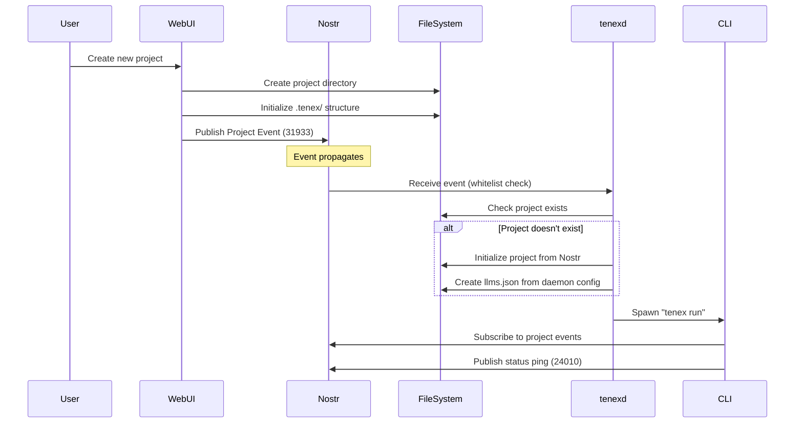
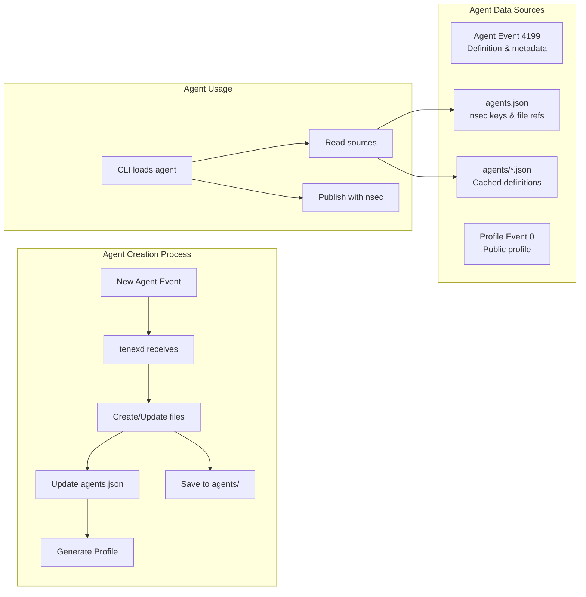
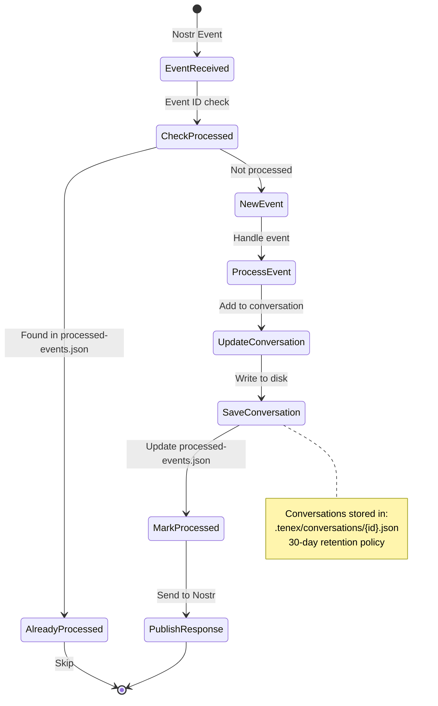
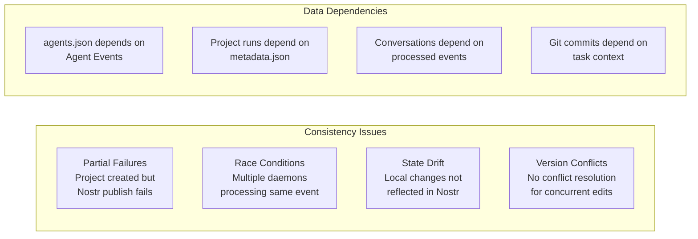
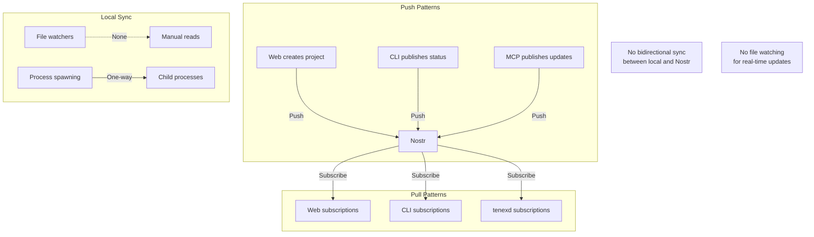

# TENEX System Data Flow & Architecture Analysis

## Executive Summary

TENEX is a distributed, event-driven development environment that orchestrates AI agents through the Nostr protocol. This analysis reveals a complex data architecture with multiple sources of truth, extensive file generation patterns, and significant synchronization challenges that arise from its decentralized nature.

## System Architecture Overview

```mermaid
graph TB
    subgraph "Nostr Network (Primary Source of Truth)"
        NE[Nostr Events]
        NE --> PE[Project Events<br/>kind: 31933]
        NE --> TE[Task Events<br/>kind: 1934]
        NE --> SE[Status Updates<br/>kind: 1]
        NE --> CE[Chat Events<br/>kind: 11, 1111]
        NE --> AE[Agent Events<br/>kind: 4199]
        NE --> PSE[Project Status<br/>kind: 24010]
        NE --> TPE[Template Events<br/>kind: 30717]
        NE --> PRE[Profile Events<br/>kind: 0]
    end

    subgraph "Local File System (Derived/Cached Data)"
        FS[File System]
        FS --> PD[Project Directory]
        PD --> TD[.tenex/]
        TD --> AJ[agents.json<br/>Agent nsec keys]
        TD --> MD[metadata.json<br/>Project metadata]
        TD --> LJ[llms.json<br/>LLM configs]
        TD --> AD[agents/<br/>Agent definitions]
        TD --> CD[conversations/<br/>Chat history]
        TD --> RD[rules/<br/>Project rules]
        TD --> PEF[processed-events.json<br/>Event tracking]
        PD --> SC[Source Code]
        PD --> GR[.git/]
    end

    subgraph "Runtime State"
        WC[Web Client]
        WC --> LS[localStorage<br/>Backend URLs]
        WC --> JA[Jotai Atoms<br/>Runtime state]
        
        CLI[CLI Tool]
        CLI --> CM[Conversation Memory]
        CLI --> PM[Process Memory]
        
        TENEXD[tenexd Daemon]
        TENEXD --> WL[Whitelist]
        TENEXD --> PS[Process State]
        
        MCP[MCP Server]
        MCP --> AS[Agent State]
    end

    subgraph "Integration Points"
        NE -.->|Subscribe| WC
        NE -.->|Subscribe| CLI
        NE -.->|Subscribe| TENEXD
        
        WC -->|Create/Update| FS
        CLI -->|Read/Write| FS
        TENEXD -->|Initialize| FS
        MCP -->|Read/Commit| GR
        
        WC -->|Publish| NE
        CLI -->|Publish| NE
        MCP -->|Publish| NE
        
        TENEXD -->|Spawn| CLI
        CLI -->|Invoke| MCP
    end
```



## Data Flow Patterns

### 1. Project Creation Flow



### 2. Agent Configuration Flow



### 3. Conversation & Event Processing



## Critical Data Modeling Issues

### 1. Multiple Sources of Truth

The system maintains multiple, potentially conflicting sources of truth:

| Data Type | Primary Source | Secondary Sources | Sync Issues |
|-----------|---------------|-------------------|-------------|
| Project Definition | Nostr Event 31933 | metadata.json, Project object in code | Manual sync required |
| Agent Configuration | Nostr Event 4199 | agents.json, agents/*.json | File generation on event receipt |
| Agent Keys | agents.json | N/A | Manual generation, no Nostr backup |
| Task State | Nostr Event 1934 | In-memory state | Event-driven updates |
| Conversation History | conversations/*.json | processed-events.json | Local only, not synced |
| Project Status | Nostr Event 24010 | Backend state, Jotai atoms | 60-second heartbeat |

### 2. Data Consistency Challenges



### 3. File Generation Patterns

The system extensively generates and modifies files:

```mermaid
flowchart TD
    subgraph "Initialization Phase"
        IP1[Project Init] --> G1[Create .tenex/]
        G1 --> G2[Generate agents.json]
        G1 --> G3[Create metadata.json]
        G1 --> G4[Fetch & save agent configs]
        IP2[tenexd Init] --> G5[Create llms.json if missing]
    end

    subgraph "Runtime Phase"
        RP1[Event Processing] --> G6[Save to conversations/]
        RP1 --> G7[Update processed-events.json]
        RP2[Agent Events] --> G8[Create agents/{id}.json]
        RP2 --> G9[Update agents.json]
        RP3[Git Operations] --> G10[Commit with context]
    end

    subgraph "Maintenance Phase"
        MP1[Cleanup Job] --> G11[Delete old conversations]
        MP2[Status Pings] --> G12[Update runtime state]
    end
```

### 4. Synchronization Architecture



## Key Findings

### 1. Event-Driven Architecture Strengths
- Decentralized coordination through Nostr
- Audit trail of all actions
- Multi-agent collaboration support
- Resilient to single point of failure

### 2. Data Model Weaknesses
- **No single source of truth**: Data scattered across Nostr events, local files, and runtime state
- **Manual synchronization**: Many data flows require manual intervention
- **No conflict resolution**: Concurrent modifications can lead to inconsistent state
- **Local-only data**: Conversations and processed events not backed up to Nostr
- **Missing data validation**: No schema enforcement between components

### 3. Caching & Performance Patterns
- Aggressive local caching in `.tenex/` directories
- Event deduplication via `processed-events.json`
- 30-day conversation retention
- No cache invalidation strategy

### 4. Security & Privacy Considerations
- Agent private keys (nsec) stored in plaintext JSON
- No encryption for sensitive project data
- Whitelist-based access control in tenexd
- Public Nostr events expose project activity

## Recommendations

### 1. Establish Clear Data Ownership
- Define primary sources of truth for each data type
- Implement automatic synchronization where possible
- Add data validation at integration points

### 2. Improve Consistency Mechanisms
- Add optimistic locking for file modifications
- Implement event sourcing for state reconstruction
- Add conflict detection and resolution

### 3. Enhance Data Security
- Encrypt sensitive data at rest
- Implement key management system
- Add access control layers

### 4. Optimize Data Flow
- Reduce redundant file I/O operations
- Implement proper caching strategies
- Add file watching for real-time updates

## Conclusion

TENEX's architecture reflects its ambitious goal of decentralized AI orchestration but suffers from complexity arising from multiple data sources and manual synchronization requirements. The system would benefit from a more unified data model with clear ownership boundaries and automated synchronization mechanisms.

The event-driven nature provides excellent auditability and collaboration features, but the lack of proper data modeling patterns creates risks for data consistency, security, and maintainability as the system scales.