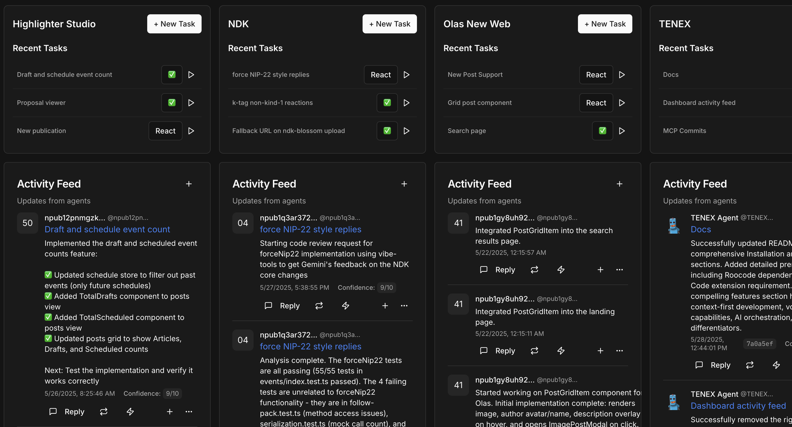

# TENEX

>  Orchestrate the orchestrators.


If LLMs represent a paradigm-shift in software development, is the text editor still the tool we use to build software?

TENEX is what a code editor might look like if we assume that code is no longer the main point of contact with the software being built, but rather, *context* is most crucial building block to manage.

## Features

TENEX revolutionizes software development by putting context at the center of the development experience. Here's what makes it powerful:

- **🎯 Context-First Development**: Move beyond traditional code editing to a paradigm where understanding and managing context drives the development process
- **🎙️ Voice-to-Code**: Transform your ideas into actionable tasks using advanced speech-to-text transcription with intelligent parsing
- **🤖 AI-Powered Orchestration**: Leverage multiple specialized AI modes (Code, Debug, Architect, Orchestrator) that work together seamlessly
- **📝 Intelligent Task Management**: Automatically parse voice input into structured tasks with titles and descriptions
- **Keys** Each project gets its worn nsec to communicate (and preserve context).
- **🔄 Real-time Collaboration**: Built on Nostr protocol for decentralized, real-time collaboration and updates
- **🎨 Multi-Column Interface**: Organize your work across multiple views for enhanced productivity
- **🔧 Extensible Architecture**: Plugin-based system that adapts to your workflow needs
- **📊 Smart Context Awareness**: AI assistants that understand your project structure and provide contextually relevant suggestions

Whether you're architecting complex systems, debugging intricate issues, or rapidly prototyping new features, TENEX provides the tools and intelligence to amplify your development capabilities.

## Installation

TENEX is designed to run locally on your development machine and integrates deeply with your existing workflow.

```
git clone https://github.com/pablof7z/tenex
cd tenex
bun install
bun run dev
```

### Prerequisites

1. **Roocode**: TENEX depends on [Roocode](https://roocode.com) being installed on your system. Make sure you have Roocode properly configured before proceeding.

2. **VS Code Extension**: Install the Roo Executor extension from the VS Code marketplace:
   - [Roo Executor Extension](https://marketplace.visualstudio.com/items?itemName=pablof7z.roo-executor)



### Author

[@pablof7z](https://njump.me/f7z.io)

### License

MIT