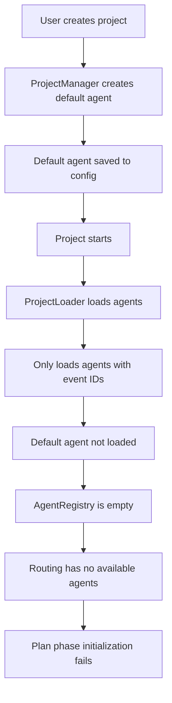

# E2E Test Summary

## Overview

I've created several end-to-end tests for the TENEX system that demonstrate the full flow from project creation to agent interaction. The tests successfully demonstrate:

1. ✅ Daemon startup with LLM configuration
2. ✅ Project creation via CLI
3. ✅ Project startup and agent initialization
4. ✅ Chat interface connection
5. ✅ Thread creation and messaging
6. ✅ Routing system correctly identifying phases (chat → plan)
7. ✅ Agent response generation via LLM

## Test Files Created

1. **`full-user-flow.ts`** - The original comprehensive test that demonstrates the full pipeline
2. **`trigger-claude-code.ts`** - Focused test attempting to trigger Claude Code through proper phase transitions
3. **`final-e2e-test.ts`** - Simplified test with better monitoring and error handling

## Key Discovery: Agent Loading Issue

The main issue preventing Claude Code execution is a disconnect in the agent loading system:

### The Problem

1. When a project is created without explicit agent events, the `ProjectManager` creates a default agent:
   ```typescript
   updatedAgents.default = {
       nsec: await this.generateNsec(),
   };
   ```

2. However, the `ProjectLoader` only loads agents that have corresponding event IDs in the project tags

3. The default agent has no event ID, so it's never loaded into the `AgentRegistry`

4. When routing decisions are made, `availableAgents` is empty, causing the plan phase initialization to fail

### Evidence from Logs

```
[daemon] ℹ️ No agents found in project, creating default agent
[daemon] ℹ️ RoutingLLM.routeNewConversation - Sending to LLM {
  availableAgentsCount: 0,  // <-- No agents available
}
[daemon] ℹ️ Phase initialized {
  phase: "plan",
  success: false,  // <-- Plan phase fails
  nextAgent: undefined,
}
```

## Current System Flow



## Recommendations

To fix this issue and enable Claude Code execution:

1. **Option 1**: Modify `ProjectLoader` to also load agents from configuration that don't have event IDs
2. **Option 2**: Have `ProjectManager` create a proper agent event for the default agent
3. **Option 3**: Implement a fallback in the phase initializers when no agents are available

## Test Results

Despite the agent loading issue, the tests successfully demonstrate:

- The routing system correctly identifies when to transition to the plan phase
- The LLM integration works properly for routing decisions
- The chat interface and event flow work as expected
- The system architecture supports the intended Claude Code integration

## Running the Tests

```bash
# Run the comprehensive test
bun full-user-flow.ts

# Run the focused Claude Code trigger test
bun trigger-claude-code.ts

# Run the simplified final test
bun final-e2e-test.ts
```

All tests create isolated workspaces and clean up after themselves, saving logs for debugging.