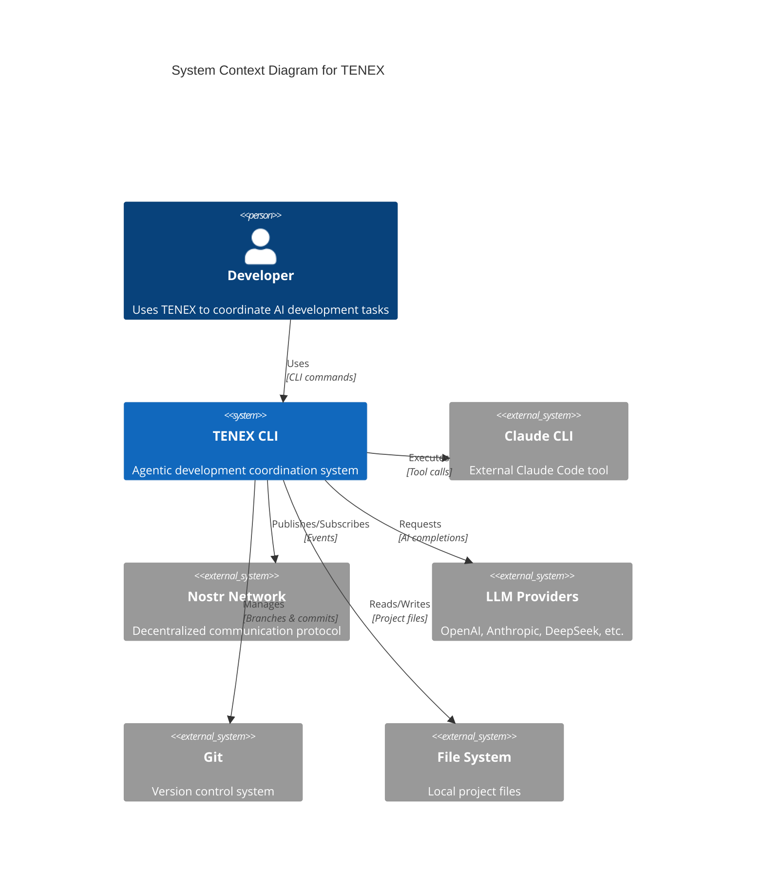
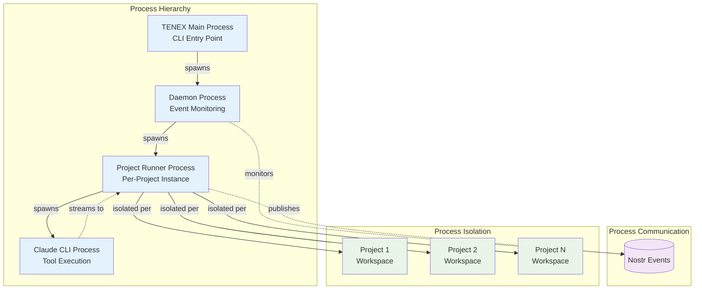
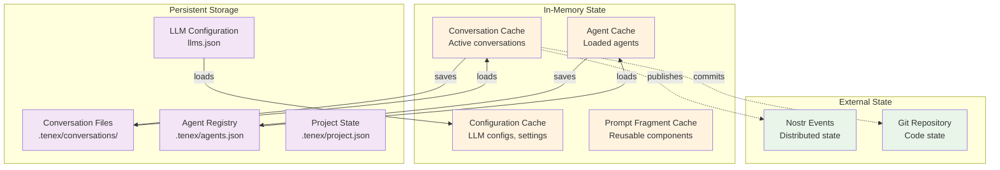
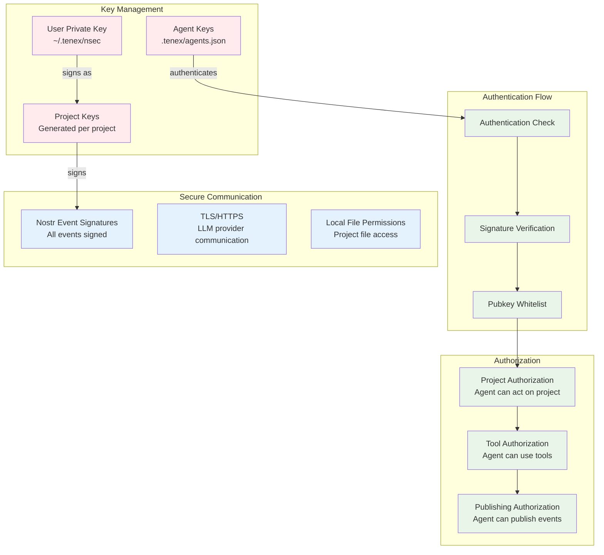
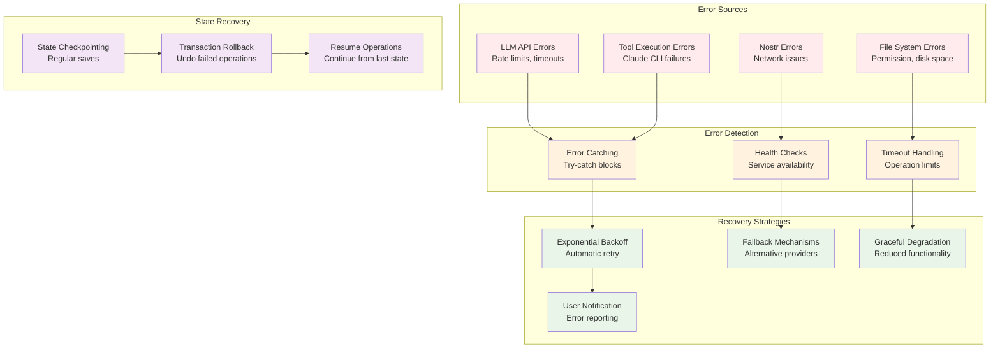
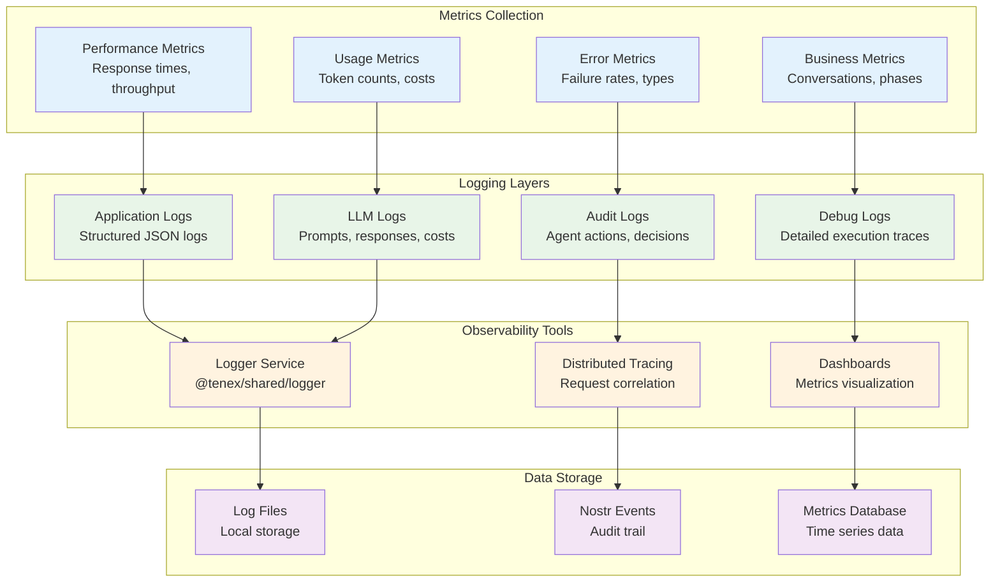
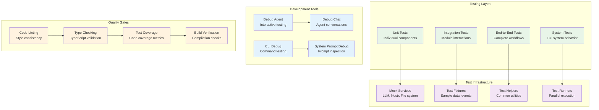
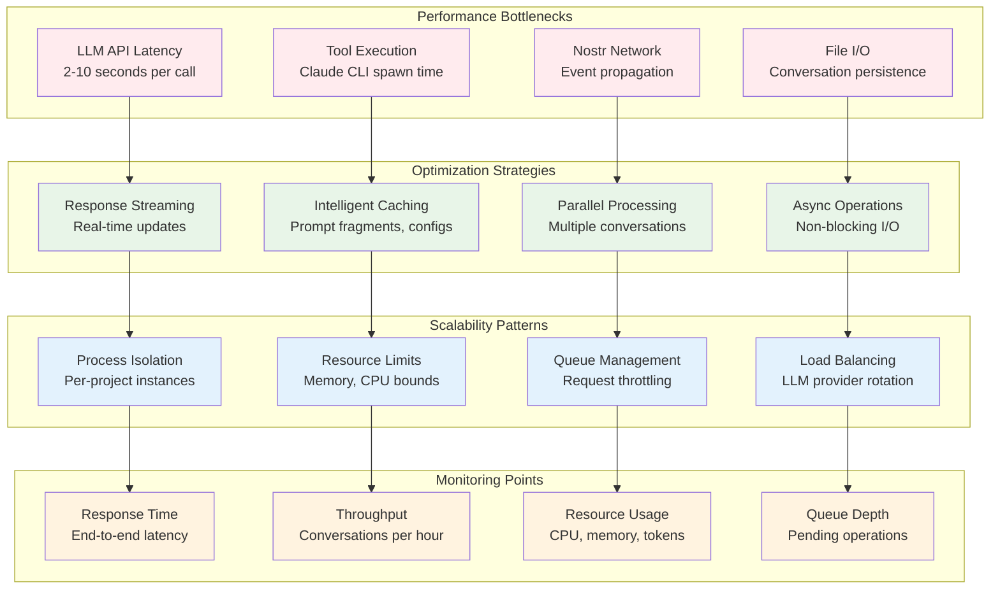

# Additional TENEX Architecture Diagrams

## 1. Component Deployment View

## 2. Process Architecture

## 3. Memory Architecture

## 4. Security Architecture

## 5. Error Handling & Recovery

## 6. Monitoring & Observability

## 7. Development & Testing Architecture

## 8. Performance & Scalability

## Architecture Decision Records (ADRs)

### ADR-001: Event-Driven Architecture
**Decision**: Use Nostr events as the primary communication mechanism  
**Rationale**: Enables distributed coordination, audit trails, and loose coupling  
**Trade-offs**: Added complexity, network dependency  

### ADR-002: Phase-Based Workflow
**Decision**: Structure conversations through defined phases  
**Rationale**: Provides clear progression, specialization, and failure isolation  
**Trade-offs**: Rigid structure, transition complexity  

### ADR-003: Process Isolation per Project
**Decision**: Run separate processes for each project  
**Rationale**: Prevents interference, enables parallel execution, fault isolation  
**Trade-offs**: Resource overhead, IPC complexity  

### ADR-004: Multi-LLM Provider Support
**Decision**: Abstract LLM providers through unified interface  
**Rationale**: Reduces vendor lock-in, enables cost optimization, provider redundancy  
**Trade-offs**: Abstraction complexity, feature parity challenges  

### ADR-005: Tool Integration via External Processes
**Decision**: Execute tools (Claude CLI) as external processes  
**Rationale**: Leverages existing tools, isolation, streaming capabilities  
**Trade-offs**: Process spawn overhead, error handling complexity  

## Operational Insights

### 1. **Resource Management**
- Each project runner consumes ~50-100MB memory
- LLM calls can use 1K-10K tokens per interaction
- Claude CLI sessions average 5-30 minutes
- Conversation files grow ~1KB per exchange

### 2. **Scaling Characteristics**
- Horizontal scaling via multiple daemon instances
- Vertical scaling limited by LLM provider rate limits
- Network bandwidth primarily for Nostr event traffic
- Storage grows linearly with conversation count

### 3. **Operational Complexity**
- Multi-process debugging requires correlation tools
- Configuration management across global/project scopes
- Key management for multiple agent identities
- Version coordination between CLI tools

### 4. **Reliability Patterns**
- Circuit breakers for LLM provider failures
- Exponential backoff for rate limit handling
- State checkpointing for long-running operations
- Graceful degradation when tools unavailable

This additional architectural documentation provides deeper insights into the operational, performance, and quality aspects of the TENEX system, complementing the core integration and data flow diagrams.