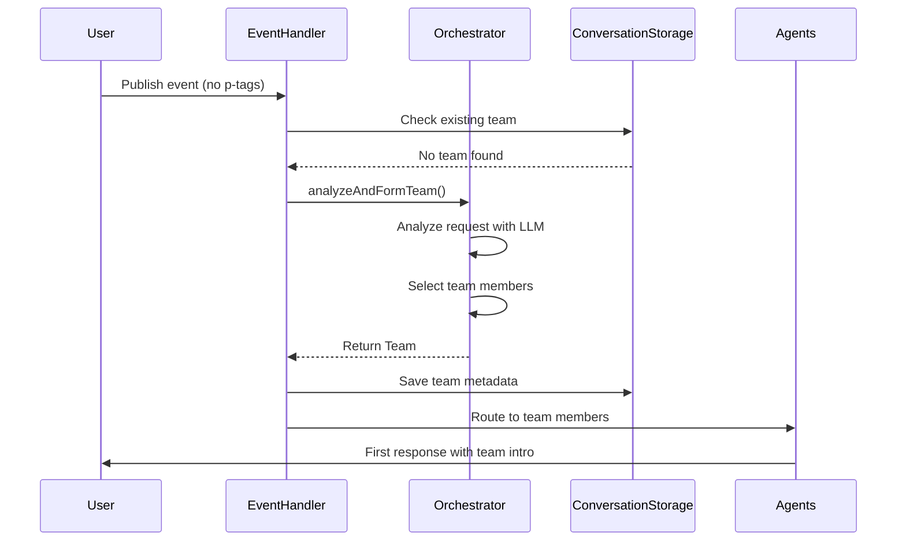
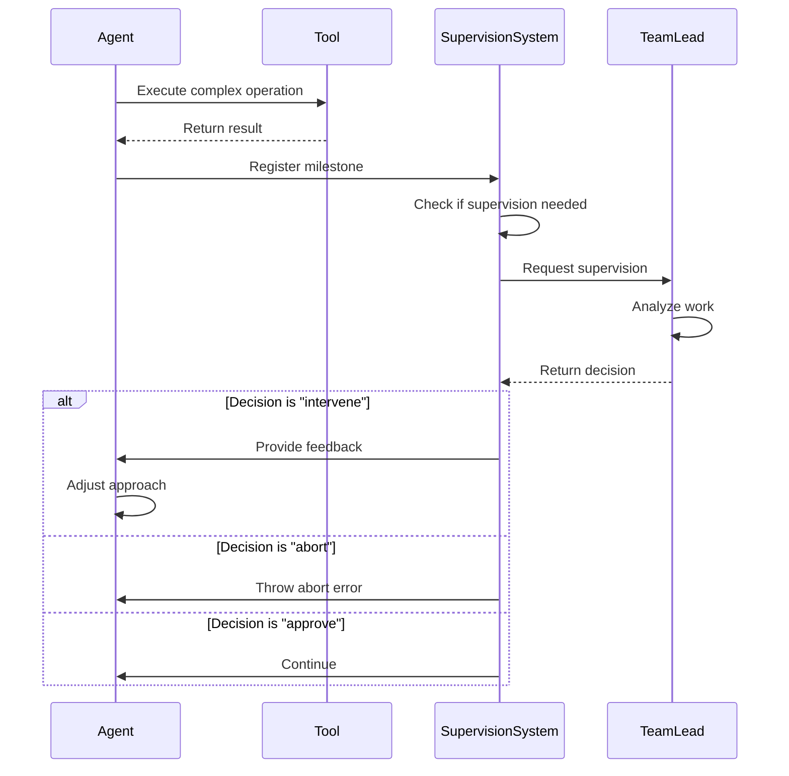
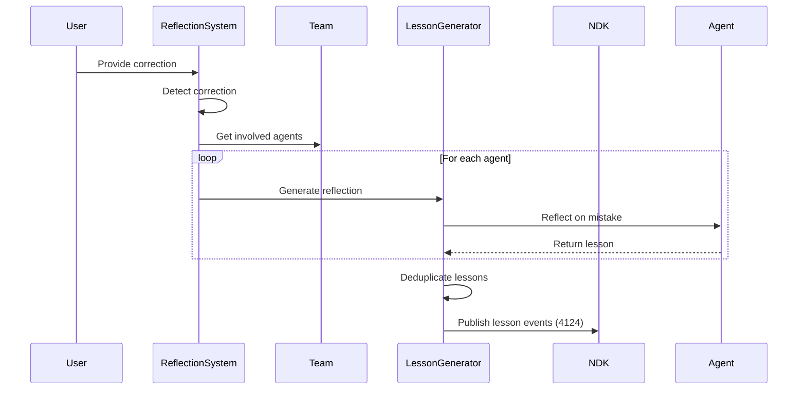
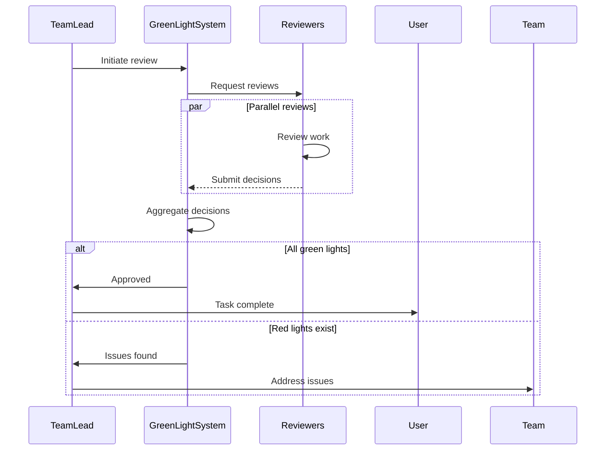

# TENEX Multi-Agent Orchestration Architecture

## Table of Contents

1. [Overview](#overview)
2. [Core Modules](#core-modules)
3. [Module Responsibilities](#module-responsibilities)
4. [Integration Architecture](#integration-architecture)
5. [Implementation Guide](#implementation-guide)
6. [Testing Strategy](#testing-strategy)
7. [Event Flow Diagrams](#event-flow-diagrams)
8. [API Specifications](#api-specifications)

## Overview

This document describes the complete architecture for TENEX's multi-agent orchestration system. The system replaces the default agent model with dynamic team formation, supervised execution, continuous learning, and quality assurance through peer review.

### Key Principles

1. **No Fallbacks**: System fails clearly when orchestration cannot proceed
2. **Testability First**: Every component designed for unit, integration, and e2e testing
3. **Clear Boundaries**: Each module has single responsibility with well-defined interfaces
4. **Event-Driven**: Loose coupling through event-based communication
5. **Dependency Injection**: All dependencies injected for maximum testability

## Core Modules

### Module Structure

```
tenex/src/
├── core/
│   ├── orchestration/
│   │   ├── TeamOrchestrator.ts
│   │   ├── TeamFormationAnalyzer.ts
│   │   ├── strategies/
│   │   │   ├── OrchestrationStrategy.ts
│   │   │   ├── SingleResponderStrategy.ts
│   │   │   ├── HierarchicalStrategy.ts
│   │   │   └── ParallelExecutionStrategy.ts
│   │   └── __tests__/
│   │       ├── TeamOrchestrator.test.ts
│   │       └── strategies/
│   ├── supervision/
│   │   ├── SupervisionSystem.ts
│   │   ├── MilestoneTracker.ts
│   │   ├── SupervisorDecisionMaker.ts
│   │   └── __tests__/
│   ├── reflection/
│   │   ├── ReflectionSystem.ts
│   │   ├── CorrectionDetector.ts
│   │   ├── LessonGenerator.ts
│   │   ├── LessonPublisher.ts
│   │   └── __tests__/
│   ├── review/
│   │   ├── GreenLightSystem.ts
│   │   ├── ReviewCoordinator.ts
│   │   ├── ReviewAggregator.ts
│   │   └── __tests__/
│   └── integration/
│       ├── OrchestrationCoordinator.ts
│       ├── TeamEventHandler.ts
│       └── __tests__/
```

## Module Responsibilities

### 1. TeamOrchestrator Module

**Purpose**: Analyze requests and form optimal teams without any fallback behavior.

```typescript
// TeamOrchestrator.ts
export interface TeamOrchestrator {
  analyzeAndFormTeam(
    event: NDKEvent,
    availableAgents: Map<string, AgentDefinition>,
    projectContext: ProjectContext
  ): Promise<Team>;
}

export class TeamOrchestratorImpl implements TeamOrchestrator {
  constructor(
    private analyzer: TeamFormationAnalyzer,
    private llmProvider: LLMProvider,
    private logger: Logger
  ) {}
  
  async analyzeAndFormTeam(
    event: NDKEvent,
    availableAgents: Map<string, AgentDefinition>,
    projectContext: ProjectContext
  ): Promise<Team> {
    // No try-catch - let errors propagate
    const analysis = await this.analyzer.analyzeRequest(event, projectContext);
    const team = await this.formTeam(analysis, availableAgents);
    
    if (!team.members.length) {
      throw new TeamFormationError("No suitable agents found for request");
    }
    
    return team;
  }
}
```

**Testing Strategy**:
- Unit tests mock LLMProvider and TeamFormationAnalyzer
- Test error cases explicitly (no agents available, LLM failure)
- Integration tests use real analyzer with mock LLM

### 2. TeamFormationAnalyzer

**Purpose**: Extract actionable insights from user requests.

```typescript
// TeamFormationAnalyzer.ts
export interface RequestAnalysis {
  requestType: string;          // Free-form, LLM-determined
  requiredCapabilities: string[];
  estimatedComplexity: number;  // 1-10 scale
  suggestedStrategy: OrchestrationStrategy;
  reasoning: string;
}

export class TeamFormationAnalyzerImpl implements TeamFormationAnalyzer {
  constructor(
    private llmProvider: LLMProvider,
    private promptBuilder: PromptBuilder
  ) {}
  
  async analyzeRequest(
    event: NDKEvent,
    context: ProjectContext
  ): Promise<RequestAnalysis> {
    const prompt = this.promptBuilder.buildAnalysisPrompt(event, context);
    const response = await this.llmProvider.complete(prompt);
    return this.parseAnalysis(response);
  }
}
```

### 3. SupervisionSystem Module

**Purpose**: Enable team leads to supervise complex operations by team members.

```typescript
// SupervisionSystem.ts
export interface SupervisionSystem {
  registerMilestone(milestone: Milestone): Promise<void>;
  shouldSupervise(milestone: Milestone): boolean;
  requestSupervision(
    milestone: Milestone,
    supervisor: Agent
  ): Promise<SupervisionDecision>;
}

export class SupervisionSystemImpl implements SupervisionSystem {
  constructor(
    private milestoneTracker: MilestoneTracker,
    private decisionMaker: SupervisorDecisionMaker,
    private complexToolsRegistry: ComplexToolsRegistry
  ) {}
  
  shouldSupervise(milestone: Milestone): boolean {
    return this.complexToolsRegistry.isComplexTool(milestone.toolName) ||
           milestone.explicitSupervisionRequest;
  }
}
```

**Key Interfaces**:

```typescript
export interface Milestone {
  id: string;
  type: 'tool_completion' | 'phase_transition' | 'checkpoint';
  agentName: string;
  toolName?: string;
  output?: any;
  timestamp: number;
  context: MilestoneContext;
}

export interface SupervisionDecision {
  action: 'approve' | 'intervene' | 'abort';
  feedback?: string;
  suggestions?: string[];
  confidence: number;
}
```

### 4. ReflectionSystem Module

**Purpose**: Detect corrections and orchestrate learning from mistakes.

```typescript
// ReflectionSystem.ts
export interface ReflectionSystem {
  checkForReflection(
    event: NDKEvent,
    conversation: Conversation
  ): Promise<ReflectionTrigger | null>;
  
  orchestrateReflection(
    trigger: ReflectionTrigger
  ): Promise<ReflectionResult>;
}

export class ReflectionSystemImpl implements ReflectionSystem {
  constructor(
    private detector: CorrectionDetector,
    private lessonGenerator: LessonGenerator,
    private lessonPublisher: LessonPublisher,
    private conversationStorage: ConversationStorage
  ) {}
  
  async checkForReflection(
    event: NDKEvent,
    conversation: Conversation
  ): Promise<ReflectionTrigger | null> {
    const isCorrection = await this.detector.isCorrection(event, conversation);
    if (!isCorrection) return null;
    
    return {
      triggerEvent: event,
      conversation,
      team: conversation.getMetadata('team'),
      detectedIssues: isCorrection.issues
    };
  }
}
```

**Lesson Generation**:

```typescript
// LessonGenerator.ts
export interface LessonGenerator {
  generateLessons(
    trigger: ReflectionTrigger,
    agents: Agent[]
  ): Promise<AgentLesson[]>;
  
  deduplicateLessons(
    lessons: AgentLesson[]
  ): Promise<AgentLesson[]>;
}

export interface AgentLesson {
  agentName: string;
  ndkAgentEventId: string;  // References the NDKAgent template
  lesson: string;
  confidence: number;
  context: LessonContext;
}
```

### 5. GreenLightSystem Module

**Purpose**: Coordinate quality assurance reviews before task completion.

```typescript
// GreenLightSystem.ts
export interface GreenLightSystem {
  shouldRequireReview(task: TaskDefinition): boolean;
  
  initiateReview(
    team: Team,
    conversation: Conversation
  ): Promise<ReviewResult>;
  
  processReviewDecisions(
    decisions: ReviewDecision[]
  ): ReviewResult;
}

export class GreenLightSystemImpl implements GreenLightSystem {
  constructor(
    private coordinator: ReviewCoordinator,
    private aggregator: ReviewAggregator,
    private logger: Logger
  ) {}
  
  async initiateReview(
    team: Team,
    conversation: Conversation
  ): Promise<ReviewResult> {
    if (!team.taskDefinition?.requiresGreenLight) {
      return { status: 'not_required' };
    }
    
    const reviewers = await this.coordinator.selectReviewers(team);
    const decisions = await this.coordinator.collectReviews(
      reviewers,
      conversation
    );
    
    return this.aggregator.aggregate(decisions);
  }
}
```

### 6. Integration Layer

**Purpose**: Coordinate all systems within the existing TENEX architecture.

```typescript
// OrchestrationCoordinator.ts
export class OrchestrationCoordinator {
  constructor(
    private orchestrator: TeamOrchestrator,
    private supervisionSystem: SupervisionSystem,
    private reflectionSystem: ReflectionSystem,
    private greenLightSystem: GreenLightSystem,
    private conversationStorage: ConversationStorage
  ) {}
  
  async handleUserEvent(
    event: NDKEvent,
    context: EventContext
  ): Promise<void> {
    const conversation = await this.conversationStorage
      .getConversation(context.conversationId);
    
    // Check for reflection first
    const reflectionTrigger = await this.reflectionSystem
      .checkForReflection(event, conversation);
      
    if (reflectionTrigger) {
      await this.reflectionSystem.orchestrateReflection(reflectionTrigger);
    }
    
    // Check for existing team
    let team = conversation?.getMetadata('team');
    
    if (!team && !context.hasPTags) {
      // Form new team - no fallback
      team = await this.orchestrator.analyzeAndFormTeam(
        event,
        context.availableAgents,
        context.projectContext
      );
      
      conversation.setMetadata('team', team);
      await this.conversationStorage.saveConversation(conversation);
    }
    
    // Continue with normal event processing...
  }
}
```

## Integration Architecture

### Integration with AgentEventHandler

The orchestration system integrates directly into the existing `AgentEventHandler` class through dependency injection:

```typescript
// AgentEventHandler with optional orchestration
export class AgentEventHandler {
  private orchestrationCoordinator?: OrchestrationCoordinator;
  
  constructor(
    configManager: AgentConfigurationManager,
    conversationStorage: ConversationStorage,
    agents: Map<string, Agent>,
    projectInfo?: ProjectInfo,
    orchestrationCoordinator?: OrchestrationCoordinator
  ) {
    // ... existing initialization
    this.orchestrationCoordinator = orchestrationCoordinator;
  }
  
  private async determineRespondingAgents(
    event: NDKEvent,
    conversationId: string,
    defaultAgentName: string,
    mentionedPubkeys: string[],
    isTaskEvent: boolean
  ): Promise<Agent[]> {
    const agentsToRespond: Agent[] = [];
    
    // First check p-tags and existing participants...
    // (existing logic for p-tags and participants)
    
    // Orchestration integration point - when no agents selected yet
    if (agentsToRespond.length === 0 && !isFromAgent && this.orchestrationCoordinator) {
      const team = await this.orchestrationCoordinator.formTeamForEvent(
        event,
        conversationId,
        await this.getAllAvailableAgents()
      );
      
      if (team) {
        // Add team members to respond
        for (const memberName of team.members) {
          const agent = await this.getAgentFn(memberName);
          if (agent) {
            agentsToRespond.push(agent);
          }
        }
        
        // Save team in conversation metadata
        const conversation = await this.conversationStorage.getConversation(conversationId);
        conversation.setMetadata('team', team);
        await this.conversationStorage.saveConversation(conversation.toJSON());
      }
    }
    
    return agentsToRespond;
  }
}
```

**Architecture Benefits**:
- **Clean Design**: No inheritance hierarchy changes needed
- **Optional Feature**: Orchestration is optional - simply pass or omit the coordinator
- **Backward Compatible**: Existing code continues to work without modification
- **Separation of Concerns**: Orchestration logic remains isolated in its own module
- **Easy Testing**: Can test AgentEventHandler with or without orchestration

### Agent Extension for Supervision

```typescript
// Extend existing Agent class
export class SupervisedAgent extends Agent {
  private supervisor?: Agent;
  private supervisionSystem: SupervisionSystem;
  
  async executeToolWithSupervision(
    toolName: string,
    params: any
  ): Promise<any> {
    const milestone: Milestone = {
      id: generateId(),
      type: 'tool_completion',
      agentName: this.getName(),
      toolName,
      timestamp: Date.now(),
      context: { params }
    };
    
    const result = await super.executeTool(toolName, params);
    
    milestone.output = result;
    await this.supervisionSystem.registerMilestone(milestone);
    
    if (this.supervisor && this.supervisionSystem.shouldSupervise(milestone)) {
      const decision = await this.supervisionSystem.requestSupervision(
        milestone,
        this.supervisor
      );
      
      if (decision.action === 'abort') {
        throw new SupervisionAbortError(decision.feedback);
      }
      
      if (decision.action === 'intervene') {
        await this.handleSupervisionFeedback(decision);
      }
    }
    
    return result;
  }
}
```

## Implementation Guide

### Phase 1: Core Infrastructure (Week 1)

1. **Create base interfaces and types**
   - `types/orchestration.ts`: Core types (Team, RequestAnalysis, etc.)
   - `types/supervision.ts`: Supervision types
   - `types/reflection.ts`: Reflection types
   - `types/review.ts`: Review types

2. **Implement TeamOrchestrator**
   - Basic analysis using existing LLM infrastructure
   - Simple team formation logic
   - Error handling without fallbacks

3. **Create integration points**
   - Extend AgentEventHandler
   - Add orchestration coordinator
   - Modify conversation storage for team metadata

### Phase 2: Supervision System (Week 2)

1. **Implement SupervisionSystem**
   - Milestone tracking
   - Complex tool registry
   - Decision making logic

2. **Extend Agent class**
   - Add supervision hooks
   - Implement milestone generation
   - Handle supervision decisions

3. **Create team lead tools**
   - Delegation capabilities
   - Progress tracking
   - Team coordination

### Phase 3: Reflection System (Week 3)

1. **Implement CorrectionDetector**
   - LLM-based correction detection
   - Conversation analysis
   - Trigger generation

2. **Build LessonGenerator**
   - Individual agent reflection
   - Lesson deduplication
   - Context preservation

3. **Create LessonPublisher**
   - NDK event creation (kind 4124)
   - Proper tagging to NDKAgent
   - Storage integration

### Phase 4: Green Light System (Week 4)

1. **Implement ReviewCoordinator**
   - Reviewer selection logic
   - Review request generation
   - Response collection

2. **Build ReviewAggregator**
   - Decision compilation
   - Conflict resolution
   - Final verdict generation

3. **Integration with task flow**
   - Hook into task completion
   - Review communication via Nostr
   - Iteration handling

## Testing Strategy

### Unit Testing

Each module should have comprehensive unit tests with mocked dependencies:

```typescript
// Example: TeamOrchestrator.test.ts
describe('TeamOrchestrator', () => {
  let orchestrator: TeamOrchestrator;
  let mockAnalyzer: jest.Mocked<TeamFormationAnalyzer>;
  let mockLLMProvider: jest.Mocked<LLMProvider>;
  
  beforeEach(() => {
    mockAnalyzer = createMockAnalyzer();
    mockLLMProvider = createMockLLMProvider();
    orchestrator = new TeamOrchestratorImpl(
      mockAnalyzer,
      mockLLMProvider,
      new TestLogger()
    );
  });
  
  describe('analyzeAndFormTeam', () => {
    it('should form team based on analysis', async () => {
      mockAnalyzer.analyzeRequest.mockResolvedValue({
        requestType: 'feature',
        requiredCapabilities: ['frontend', 'backend'],
        estimatedComplexity: 7,
        suggestedStrategy: OrchestrationStrategy.HIERARCHICAL,
        reasoning: 'Complex feature requiring coordination'
      });
      
      const team = await orchestrator.analyzeAndFormTeam(
        mockEvent,
        mockAgents,
        mockContext
      );
      
      expect(team.members).toContain('frontend-agent');
      expect(team.members).toContain('backend-agent');
      expect(team.strategy).toBe(OrchestrationStrategy.HIERARCHICAL);
    });
    
    it('should throw when no suitable agents found', async () => {
      mockAnalyzer.analyzeRequest.mockResolvedValue({
        requiredCapabilities: ['quantum-computing'],
        // ... other fields
      });
      
      await expect(orchestrator.analyzeAndFormTeam(
        mockEvent,
        mockAgents,
        mockContext
      )).rejects.toThrow(TeamFormationError);
    });
  });
});
```

### Integration Testing

Test module interactions with real implementations but mocked external services:

```typescript
// Example: orchestration.integration.test.ts
describe('Orchestration Integration', () => {
  let coordinator: OrchestrationCoordinator;
  let conversationStorage: ConversationStorage;
  
  beforeEach(async () => {
    // Use real implementations with test database
    conversationStorage = new ConversationStorageImpl(testDb);
    
    coordinator = new OrchestrationCoordinator(
      new TeamOrchestratorImpl(...),
      new SupervisionSystemImpl(...),
      new ReflectionSystemImpl(...),
      new GreenLightSystemImpl(...),
      conversationStorage
    );
  });
  
  it('should handle complete flow from request to team formation', async () => {
    const event = createTestEvent('Build a search feature');
    
    await coordinator.handleUserEvent(event, {
      conversationId: 'test-123',
      hasPTags: false,
      availableAgents: testAgents,
      projectContext: testContext
    });
    
    const conversation = await conversationStorage
      .getConversation('test-123');
    const team = conversation.getMetadata('team');
    
    expect(team).toBeDefined();
    expect(team.members.length).toBeGreaterThan(0);
    expect(team.taskDefinition).toBeDefined();
  });
});
```

### End-to-End Testing

Test complete user flows with real Nostr events:

```typescript
// Example: e2e/team-orchestration.e2e.test.ts
describe('Team Orchestration E2E', () => {
  let testProject: TestProject;
  let ndk: NDK;
  
  beforeAll(async () => {
    testProject = await createTestProject();
    ndk = await createTestNDK();
  });
  
  it('should orchestrate team for feature request', async () => {
    // 1. User creates request
    const requestEvent = await publishUserRequest(
      'Add user authentication',
      testProject
    );
    
    // 2. Wait for team formation and first response
    const responseEvent = await waitForAgentResponse(ndk, {
      replyTo: requestEvent.id,
      timeout: 30000
    });
    
    // 3. Verify team was formed
    expect(responseEvent.content).toContain('work on this with');
    
    // 4. Verify team members are participating
    const conversation = await getConversation(requestEvent.id);
    expect(conversation.participants.length).toBeGreaterThan(1);
  });
  
  it('should trigger reflection on correction', async () => {
    // 1. Team completes work
    const taskCompletion = await simulateTaskCompletion(testProject);
    
    // 2. User provides correction
    const correctionEvent = await publishUserCorrection(
      'The API endpoint is wrong',
      taskCompletion
    );
    
    // 3. Wait for lesson events
    const lessonEvents = await waitForLessonEvents(ndk, {
      relatedTo: correctionEvent.id,
      timeout: 60000
    });
    
    expect(lessonEvents.length).toBeGreaterThan(0);
    expect(lessonEvents[0].kind).toBe(4124);
  });
});
```

## Event Flow Diagrams

### Team Formation Flow



### Supervision Flow



### Reflection Flow



### Green Light Flow



## API Specifications

### Core Types

```typescript
// types/orchestration.ts
export interface Team {
  id: string;
  conversationId: string;
  lead: string;
  members: string[];
  strategy: OrchestrationStrategy;
  taskDefinition?: TaskDefinition;
  formation: TeamFormation;
}

export interface TaskDefinition {
  description: string;
  successCriteria: string[];
  requiresGreenLight: boolean;
  reviewers?: string[];
  estimatedComplexity: number;
}

export interface TeamFormation {
  timestamp: number;
  reasoning: string;
  requestAnalysis: RequestAnalysis;
}

export interface RequestAnalysis {
  requestType: string;
  requiredCapabilities: string[];
  estimatedComplexity: number;
  suggestedStrategy: OrchestrationStrategy;
  reasoning: string;
}

export enum OrchestrationStrategy {
  SINGLE_RESPONDER = 'single_responder',
  HIERARCHICAL = 'hierarchical',
  PARALLEL_EXECUTION = 'parallel_execution',
  PHASED_DELIVERY = 'phased_delivery',
  EXPLORATORY = 'exploratory'
}
```

### Event Formats

```typescript
// Lesson Event (NDK Kind 4124)
{
  "kind": 4124,
  "content": "Always verify the database schema before implementing queries to avoid field mismatches",
  "tags": [
    ["e", "ndkAgentEventId"],  // References the NDKAgent template
    ["title", "Verify schema before queries"],
    ["context", "bug_fix"],
    ["confidence", "0.9"]
  ]
}

// Review Decision (in conversation)
{
  "kind": 1111,
  "content": "✅ Green light - API endpoints follow REST conventions and handle errors properly",
  "tags": [
    ["review-decision", "approve"],
    ["review-scope", "api"],
    ["e", "conversationId"],
    ["a", "projectReference"]
  ]
}
```

### Error Types

```typescript
export class TeamFormationError extends Error {
  constructor(message: string, public analysis?: RequestAnalysis) {
    super(message);
    this.name = 'TeamFormationError';
  }
}

export class SupervisionAbortError extends Error {
  constructor(message: string, public milestone: Milestone) {
    super(message);
    this.name = 'SupervisionAbortError';
  }
}

export class ReviewTimeoutError extends Error {
  constructor(public reviewers: string[], public timeout: number) {
    super(`Review timeout after ${timeout}ms`);
    this.name = 'ReviewTimeoutError';
  }
}
```

## Configuration

### System Configuration

```typescript
// config/orchestration.config.ts
export interface OrchestrationConfig {
  orchestrator: {
    llmConfig: string;  // Reference to LLM config
    maxTeamSize: number;
    strategies: {
      [key: string]: OrchestrationStrategy;
    };
  };
  
  supervision: {
    complexTools: string[];
    supervisionTimeout: number;
    llmConfig?: string;  // Optional different LLM for supervision
  };
  
  reflection: {
    enabled: boolean;
    detectionThreshold: number;  // 0-1 confidence threshold
    maxLessonsPerAgent: number;
    llmConfig?: string;
  };
  
  greenLight: {
    defaultRequiredFor: string[];  // Task types requiring review
    reviewTimeout: number;
    parallelReviews: boolean;
  };
}
```

### Default Configuration

```typescript
export const defaultOrchestrationConfig: OrchestrationConfig = {
  orchestrator: {
    llmConfig: 'default',
    maxTeamSize: 5,
    strategies: {
      simple: OrchestrationStrategy.SINGLE_RESPONDER,
      moderate: OrchestrationStrategy.HIERARCHICAL,
      complex: OrchestrationStrategy.PHASED_DELIVERY
    }
  },
  
  supervision: {
    complexTools: [
      'claude_code',
      'architectural_refactor',
      'database_migration',
      'security_audit'
    ],
    supervisionTimeout: 60000  // 1 minute
  },
  
  reflection: {
    enabled: true,
    detectionThreshold: 0.7,
    maxLessonsPerAgent: 100,
  },
  
  greenLight: {
    defaultRequiredFor: ['feature', 'refactor', 'security_fix'],
    reviewTimeout: 300000,  // 5 minutes
    parallelReviews: true
  }
};
```

## Performance Considerations

### Optimization Strategies

1. **Parallel Processing**
   - Team member responses can be generated in parallel
   - Reviews happen concurrently
   - Reflection sessions are independent per agent

2. **Caching**
   - Cache team formations for similar requests (with TTL)
   - Cache agent capability analysis
   - Store supervision decisions for pattern learning

3. **Resource Management**
   - Limit concurrent LLM calls
   - Queue supervision requests to prevent overload
   - Batch lesson generation when possible

### Monitoring Points

```typescript
export interface OrchestrationMetrics {
  teamFormation: {
    averageTime: number;
    failureRate: number;
    averageTeamSize: number;
  };
  
  supervision: {
    interventionRate: number;
    averageDecisionTime: number;
    abortRate: number;
  };
  
  reflection: {
    lessonsGenerated: number;
    reflectionTriggerRate: number;
    lessonApplicationRate: number;
  };
  
  greenLight: {
    approvalRate: number;
    averageReviewTime: number;
    iterationsToApproval: number;
  };
}
```

## Security Considerations

1. **Agent Authority**
   - Team leads cannot execute operations on behalf of team members
   - Supervision is advisory only, not controlling
   - Each agent maintains its own nsec and signs its own events

2. **Lesson Validation**
   - Lessons are signed by the learning agent
   - Cannot forge lessons for other agents
   - Lessons reference verified NDKAgent events

3. **Review Integrity**
   - Reviews are signed Nostr events
   - Cannot impersonate other reviewers
   - Audit trail maintained in conversation

## Migration Path

### From Current System

1. **Phase 1**: Deploy orchestration alongside existing system
   - New conversations use orchestration
   - Existing conversations continue as-is
   - Monitor metrics and performance

2. **Phase 2**: Gradual rollout
   - Enable for specific project types
   - Gather feedback and iterate
   - Train team on new capabilities

3. **Phase 3**: Full deployment
   - All new conversations use orchestration
   - Provide migration tools for active projects
   - Deprecate old default agent approach

## Conclusion

This architecture provides a robust, testable foundation for multi-agent orchestration in TENEX. Key benefits:

1. **No Fallbacks**: Clear failure modes improve debugging and reliability
2. **Testability**: Every component can be tested in isolation
3. **Flexibility**: LLM-driven analysis adapts to new request types
4. **Learning**: Continuous improvement through reflection
5. **Quality**: Built-in review processes ensure high standards

The modular design allows incremental implementation while maintaining system stability.