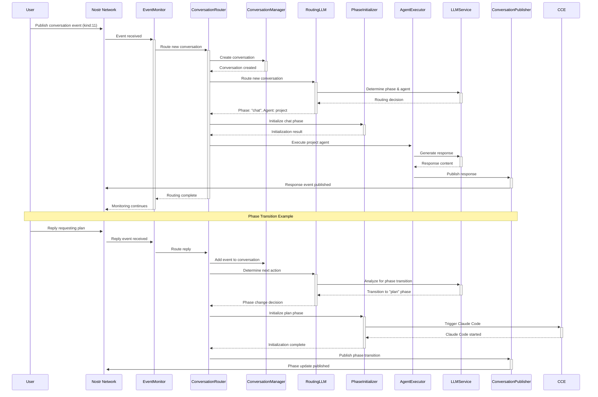
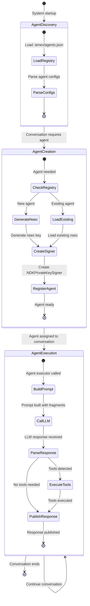
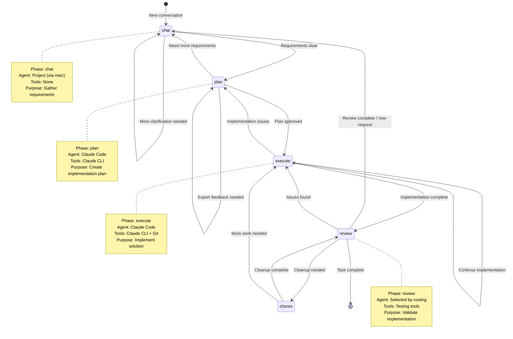
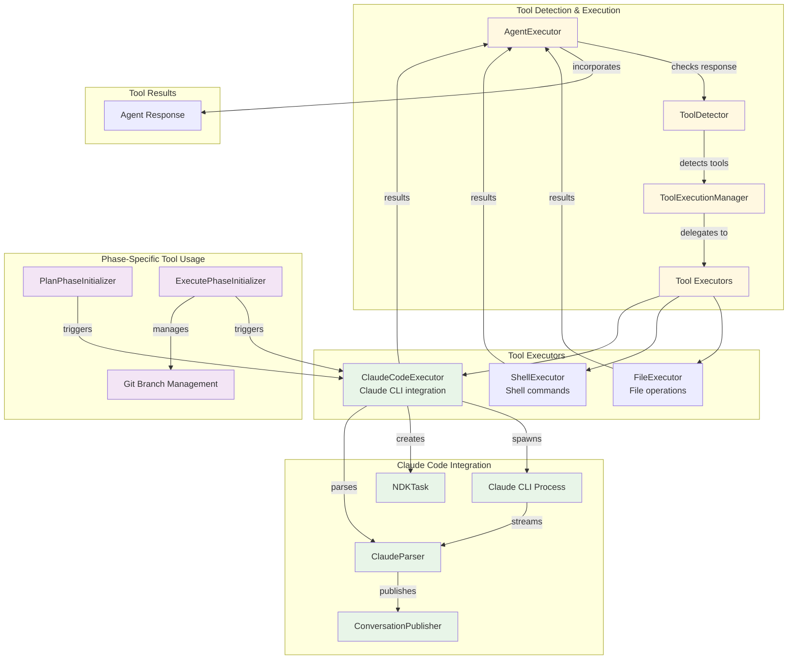
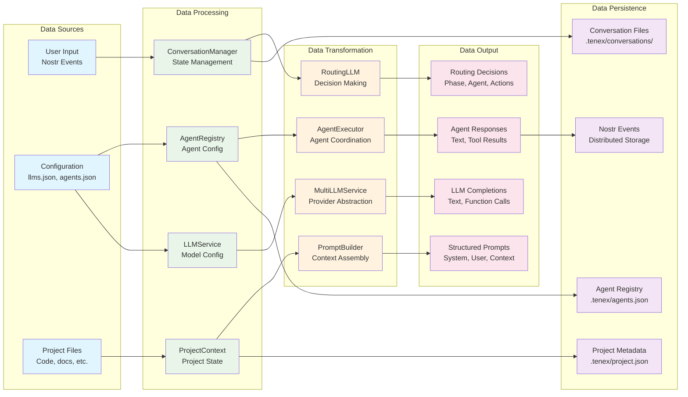
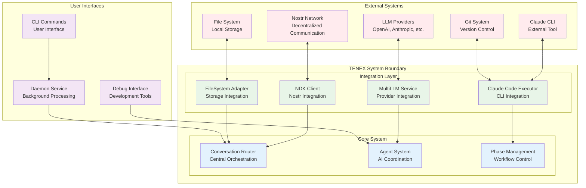

# TENEX System Architecture Diagrams

## 1. Module Integration Overview

```mermaid
graph TB
    subgraph "CLI Layer"
        CLI[TENEX CLI<br/>commands/*] --> |commands| CMD{Command Router}
        CMD --> |daemon| DAEMON[Daemon Command]
        CMD --> |project| PROJECT[Project Commands]
        CMD --> |setup| SETUP[Setup Commands]
        CMD --> |debug| DEBUG[Debug Commands]
    end

    subgraph "Core Event System"
        DAEMON --> |monitors| EM[EventMonitor<br/>daemon/EventMonitor]
        EM --> |receives| NOSTR[(Nostr Network<br/>NDK)]
        EM --> |triggers| PM[ProcessManager<br/>daemon/ProcessManager]
        PM --> |spawns| PROJMGR[ProjectManager<br/>daemon/ProjectManager]
    end

    subgraph "Conversation Flow"
        PROJMGR --> |routes to| CR[ConversationRouter<br/>routing/ConversationRouter]
        CR --> |manages| CM[ConversationManager<br/>conversations/ConversationManager]
        CR --> |uses| RL[RoutingLLM<br/>routing/RoutingLLM]
        CM --> |persists| FS[FileSystemAdapter<br/>conversations/persistence]
    end

    subgraph "Phase Management"
        CR --> |initializes| PIF[PhaseInitializerFactory<br/>phases/PhaseInitializerFactory]
        PIF --> |creates| PI1[ChatPhaseInitializer]
        PIF --> |creates| PI2[PlanPhaseInitializer] 
        PIF --> |creates| PI3[ExecutePhaseInitializer]
        PIF --> |creates| PI4[ReviewPhaseInitializer]
    end

    subgraph "Agent System"
        CR --> |executes via| AE[AgentExecutor<br/>agents/execution/AgentExecutor]
        AE --> |manages| AR[AgentRegistry<br/>agents/AgentRegistry]
        AE --> |builds prompts| APB[AgentPromptBuilder<br/>agents/execution/AgentPromptBuilder]
        AR --> |stores| AGENTFILE[(agents.json)]
    end

    subgraph "LLM Integration"
        AE --> |uses| LLM[LLMService<br/>llm/LLMService]
        RL --> |uses| LLM
        LLM --> |configured by| LLMCFG[ConfigManager<br/>llm/ConfigManager]
        LLM --> |delegates to| MLLM[MultiLLMService<br/>core/llm/MultiLLMService]
        LLMCFG --> |reads| LLMFILE[(llms.json)]
    end

    subgraph "Prompt System"
        APB --> |uses| PB[PromptBuilder<br/>prompts/core/PromptBuilder]
        PB --> |manages| FR[FragmentRegistry<br/>prompts/core/FragmentRegistry]
        FR --> |loads| FRAG[Fragment Files<br/>prompts/fragments/*]
        PB --> |uses| TEMP[Template Files<br/>prompts/templates/*]
    end

    subgraph "Tool Execution"
        AE --> |can execute| TEM[ToolExecutionManager<br/>tools/execution/ToolExecutionManager]
        TEM --> |detects| TD[ToolDetector<br/>tools/execution/ToolDetector]
        TEM --> |uses| TE[Tool Executors<br/>tools/execution/executors/*]
        PI2 --> |triggers| CCE[ClaudeCodeExecutor<br/>tools/ClaudeCodeExecutor]
        PI3 --> |triggers| CCE
    end

    subgraph "Publishing System"
        AE --> |publishes via| CP[ConversationPublisher<br/>nostr/ConversationPublisher]
        CR --> |publishes via| CP
        CCE --> |publishes via| CP
        CP --> |uses| NDK[NDKClient<br/>nostr/ndkClient]
        NDK --> |publishes to| NOSTR
    end

    subgraph "Runtime Context"
        CR --> |accesses| PC[ProjectContext<br/>runtime/ProjectContext]
        AE --> |accesses| PC
        PC --> |provides| PROJDATA[(Project Data<br/>agents, config, metadata)]
    end

    subgraph "Utilities & Support"
        CM --> |uses| UTILS[Utilities<br/>utils/*]
        AE --> |uses| UTILS
        UTILS --> |includes| PARSER[ClaudeParser<br/>utils/claude/ClaudeParser]
        UTILS --> |includes| RULES[RulesManager<br/>utils/RulesManager]
    end

    classDef cliLayer fill:#e1f5fe
    classDef eventSystem fill:#f3e5f5
    classDef conversation fill:#e8f5e8
    classDef phases fill:#fff3e0
    classDef agents fill:#fce4ec
    classDef llm fill:#f1f8e9
    classDef prompts fill:#e0f2f1
    classDef tools fill:#fff8e1
    classDef publishing fill:#e3f2fd
    classDef runtime fill:#fafafa
    classDef storage fill:#ffebee

    class CLI,CMD,DAEMON,PROJECT,SETUP,DEBUG cliLayer
    class EM,PM,PROJMGR,NOSTR eventSystem
    class CR,CM,RL,FS conversation
    class PIF,PI1,PI2,PI3,PI4 phases
    class AE,AR,APB,AGENTFILE agents
    class LLM,LLMCFG,MLLM,LLMFILE llm
    class PB,FR,FRAG,TEMP,APB prompts
    class TEM,TD,TE,CCE tools
    class CP,NDK publishing
    class PC,PROJDATA runtime
    class UTILS,PARSER,RULES,FS,AGENTFILE,LLMFILE,PROJDATA storage
```

## 2. Event Flow Sequence Diagram

## 3. Agent Lifecycle Diagram

## 4. Phase Transition State Machine

## 5. Tool Integration Architecture

## 6. Data Flow Architecture

## 7. System Boundaries and Integration Points

## Key Architectural Insights

### 1. **Event-Driven Architecture**
- All communication flows through Nostr events
- EventMonitor acts as the primary event ingress point
- ConversationRouter serves as the central orchestrator
- Events are published back to Nostr for distributed coordination

### 2. **Phase-Based Workflow**
- Conversations progress through defined phases: chat → plan → execute → review
- Each phase has specialized initialization logic
- Phase transitions are controlled by business rules and LLM decisions
- Phases can transition bidirectionally based on feedback

### 3. **Agent Orchestration**
- AgentRegistry manages agent lifecycle and configuration  
- AgentExecutor coordinates agent execution with LLM calls
- Agents are specialized by role (chat, planning, execution, review)
- Agent responses are published as Nostr events

### 4. **Modular LLM Integration**
- MultiLLMService provides provider abstraction
- Different agents can use different LLM configurations
- Prompt system uses modular fragments for flexible composition
- LLM responses are parsed for tool calls and structured output

### 5. **Tool Integration Strategy**
- Tools are detected from LLM responses and executed automatically
- ClaudeCodeExecutor provides deep integration with Claude CLI
- Tool results are incorporated back into agent responses
- Phase-specific tools (like git branching) are managed by phase initializers

### 6. **Persistent State Management**  
- Conversations are persisted locally with FileSystemAdapter
- Agent registry maintains nsec keys and configurations
- Project context provides global state across the system
- All state changes are reflected in Nostr events for coordination

This architecture enables a distributed, AI-coordinated development workflow where multiple agents collaborate through structured phases to accomplish complex software development tasks.