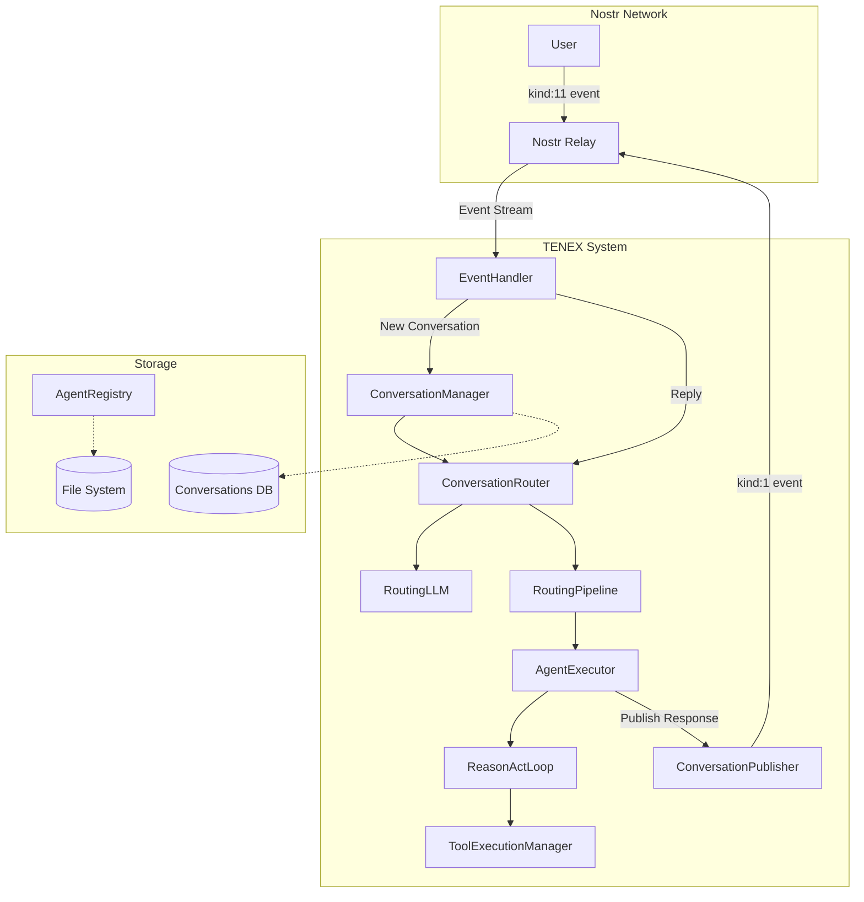
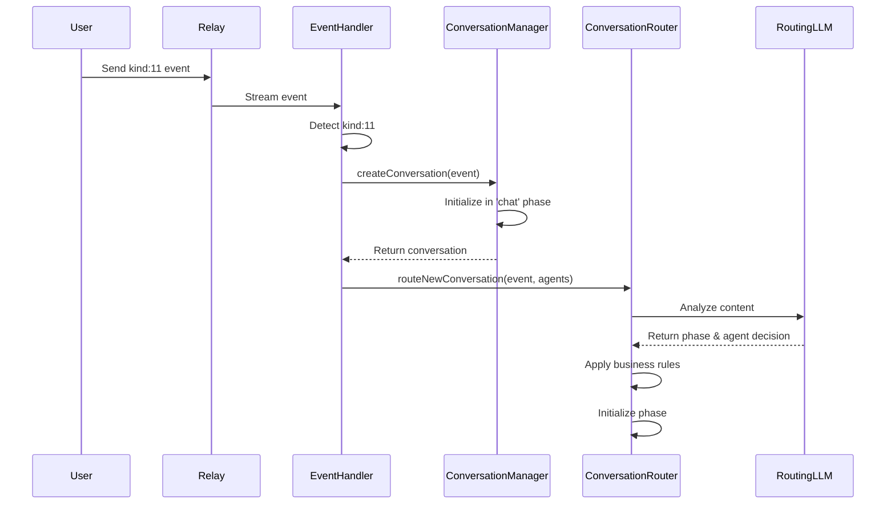
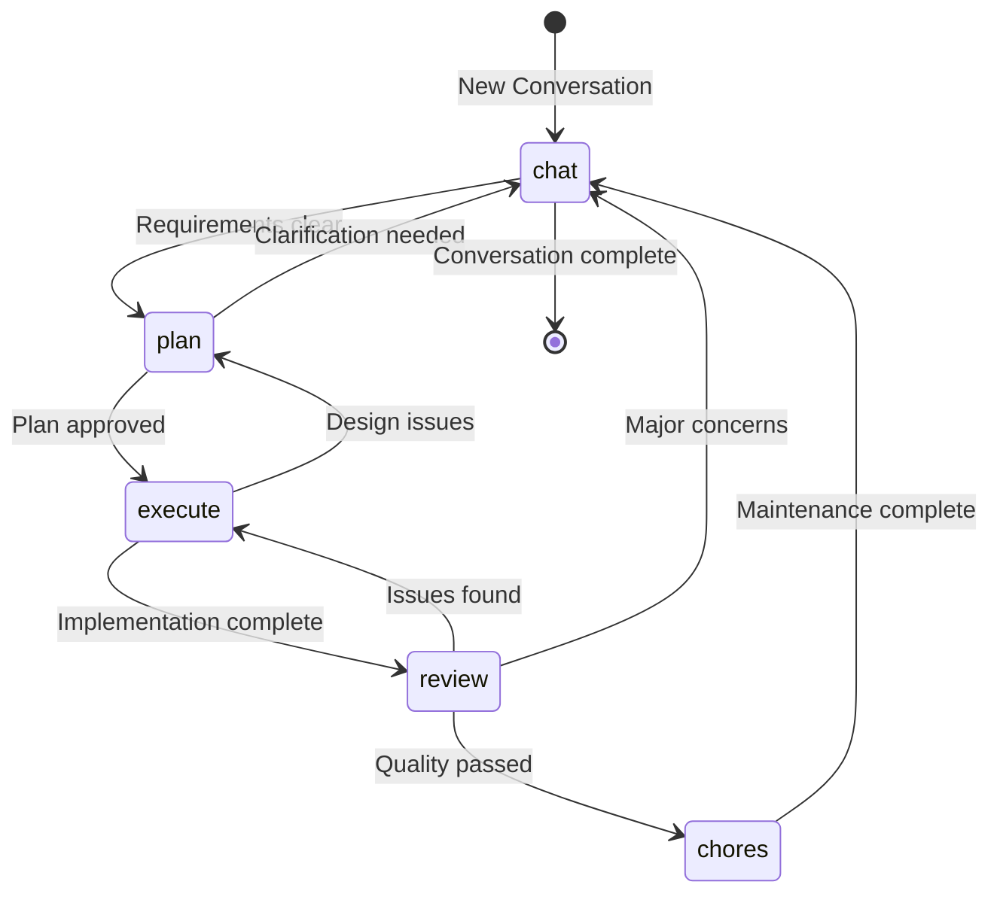
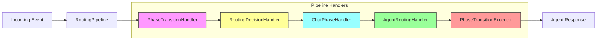
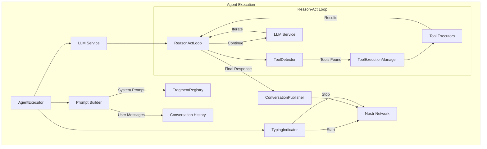
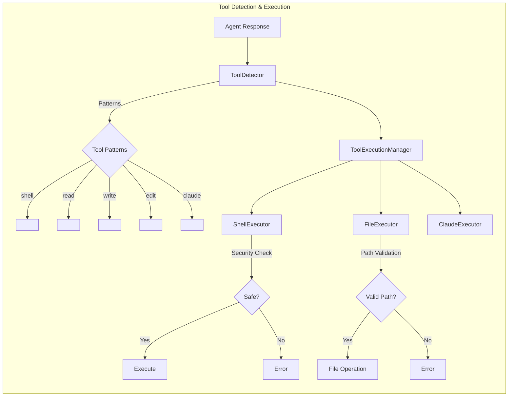

# TENEX: Comprehensive Technical Report on Conversation Flow Architecture

## Executive Summary

TENEX is a sophisticated Nostr-based development orchestration system that manages software development conversations through distinct phases, leveraging AI agents and tools. This report provides an in-depth technical analysis of how the system processes conversations from initial thread creation (kind:11 events) through completion.

## System Architecture Overview

## Core Flow: Thread Initialization to Response

### 1. Thread Initialization (kind:11)

When a user starts a new thread:

### 2. Phase Management System

### 3. Routing Pipeline Architecture

### 4. Agent Execution Flow

### 5. Tool Execution System

## Technical Deep Dive

### Event Processing Layer

The system begins with `EventHandler` monitoring the Nostr relay for incoming events:

1. **Event Classification**: Distinguishes between new conversations (kind:11) and replies (kind:1)
2. **Conversation Management**: Creates or retrieves conversation state via `ConversationManager`
3. **Routing Delegation**: Hands off to `ConversationRouter` for intelligent routing

### Conversation State Management

`ConversationManager` maintains conversation state with:
- **Persistence**: SQLite database for conversation metadata
- **Phase Tracking**: Current phase, transitions, and history
- **Event Association**: Links Nostr events to conversations
- **Agent Assignment**: Tracks which agents are handling conversations

### Intelligent Routing System

The routing system employs a sophisticated pipeline pattern:

1. **PhaseTransitionHandler**: Detects explicit phase transition requests
2. **RoutingDecisionHandler**: Uses LLM to make routing decisions
3. **ChatPhaseHandler**: Handles chat phase with project agent
4. **AgentRoutingHandler**: Routes to specialized agents
5. **PhaseTransitionExecutor**: Executes phase transitions

### Agent System Architecture

Agents are first-class entities with:
- **Identity**: Own Nostr keypair and profile
- **Capabilities**: Defined tools and expertise
- **Instructions**: Role-specific guidance
- **LLM Configuration**: Specific model preferences

### Tool Integration

The tool system provides agents with capabilities:
- **File Operations**: Read, write, edit with security boundaries
- **Shell Execution**: Command execution with safety checks
- **Web Search**: Information retrieval
- **Claude Code**: Integration with external AI tools

### Fragment-Based Prompt System

Prompts are constructed dynamically from fragments:
- **agent-system-prompt**: Core identity and instructions
- **conversation-history**: Recent context
- **phase-context**: Phase-specific guidance
- **tool-context**: Available tool instructions

## Phase Completion Criteria

Each phase has specific completion criteria:

### Chat Phase
- Requirements captured and documented
- User needs clarified
- Ready for planning or implementation

### Plan Phase
- Architecture documented
- Implementation tasks identified
- User approval obtained
- Technical approach validated

### Execute Phase
- All tasks completed
- Tests passing
- Code committed
- No blocking issues

### Review Phase
- Quality validation complete
- Tests conducted
- Feedback incorporated
- Ready for deployment or maintenance

### Chores Phase
- Documentation updated
- Dependencies inventoried
- Cleanup completed
- Maintenance tasks done

## Security Architecture

The system implements multiple security layers:

1. **Path Sandboxing**: File operations restricted to project directory
2. **Command Filtering**: Dangerous shell commands blocked
3. **Timeout Protection**: Operations time-limited
4. **Size Limits**: File and output size restrictions
5. **Nostr Authentication**: Event signatures validate identity

## Performance Optimizations

1. **Conversation Caching**: In-memory cache for active conversations
2. **Fragment Caching**: Reusable prompt components
3. **Parallel Tool Execution**: Multiple tools can run concurrently
4. **Event Batching**: Efficient Nostr event processing
5. **LLM Streaming**: Real-time response generation

## 10 Ideas for Improvement and Exploration

1. **Multi-Agent Collaboration**: Enable multiple agents to work on the same phase simultaneously, with coordination mechanisms for dividing work and merging results.

2. **Visual Development Interface**: Create a web-based visualization of conversation flow, phase transitions, and agent activities in real-time using the Nostr event stream.

3. **Agent Learning System**: Implement a feedback loop where agents learn from successful patterns and improve their expertise over time through reinforcement learning.

4. **Plugin Architecture**: Develop a plugin system for custom tools and executors, allowing third-party extensions without modifying core code.

5. **Distributed Agent Network**: Enable agents to run on different machines, creating a distributed development network connected via Nostr.

6. **Smart Contract Integration**: Integrate with blockchain smart contracts for automated payments, bounties, or milestone tracking.

7. **AI Code Review System**: Implement an automated code review phase that uses multiple specialized AI models to check for security, performance, and best practices.

8. **Natural Language Testing**: Allow users to describe test scenarios in natural language, automatically generating and executing test suites.

9. **Project Template System**: Create reusable project templates with pre-configured agents, phases, and workflows for common development patterns.

10. **Real-time Collaboration**: Enable multiple human users to participate in the same conversation thread with role-based permissions and coordinated agent responses.

## 10 Implementation Priorities (Ordered by Importance/Urgency)

1. **Error Recovery Mechanism** (Critical)
   - Implement robust error handling for failed agent executions
   - Add retry logic with exponential backoff
   - Create fallback strategies for tool execution failures
   - *Urgency: Prevents system failures in production*

2. **Conversation History Limits** (High)
   - Implement sliding window for conversation context
   - Add conversation summarization for long threads
   - Optimize token usage in LLM calls
   - *Urgency: Current approach will hit token limits*

3. **Agent Performance Monitoring** (High)
   - Add metrics collection for agent response times
   - Track tool execution performance
   - Monitor LLM token usage per agent
   - *Urgency: Need visibility into system performance*

4. **Phase Rollback Capability** (High)
   - Allow reverting to previous phases
   - Implement conversation checkpointing
   - Add undo/redo for agent actions
   - *Urgency: Users need recovery from mistakes*

5. **Tool Result Caching** (Medium-High)
   - Cache file reads and shell command results
   - Implement intelligent cache invalidation
   - Reduce redundant tool executions
   - *Urgency: Significant performance improvement*

6. **Agent Capability Discovery** (Medium)
   - Implement agent self-description protocol
   - Add dynamic tool registration
   - Create agent marketplace/registry
   - *Urgency: Improves agent ecosystem*

7. **Workflow Templates** (Medium)
   - Create reusable conversation patterns
   - Implement workflow inheritance
   - Add workflow versioning
   - *Urgency: Accelerates common tasks*

8. **Multi-Project Support** (Medium)
   - Enable agents to work across projects
   - Implement project context switching
   - Add cross-project dependency management
   - *Urgency: Enterprise use cases need this*

9. **Advanced Security Policies** (Low-Medium)
   - Implement fine-grained permission system
   - Add tool execution policies per agent
   - Create audit logging for all actions
   - *Urgency: Important for enterprise adoption*

10. **Agent Training Interface** (Low)
    - Build UI for training custom agents
    - Implement few-shot learning integration
    - Add agent performance evaluation
    - *Urgency: Future enhancement for customization*

## Conclusion

TENEX represents a sophisticated approach to AI-assisted software development, leveraging Nostr's decentralized architecture to create a flexible, extensible system for managing complex development workflows. The modular design, with clear separation between routing, execution, and tool layers, provides a solid foundation for future enhancements while maintaining security and performance.

The system's strength lies in its ability to maintain context across long conversations while providing specialized agents with powerful tools to execute real development tasks. The phase-based approach ensures structured progression while allowing flexibility for iterative development.

Key architectural decisions—such as the pipeline-based routing system, fragment-based prompt construction, and secure tool execution framework—demonstrate thoughtful design that balances power with safety. The integration with Nostr provides unique benefits for decentralized collaboration and event-driven architecture.

Future development should focus on the identified implementation priorities, particularly error recovery and performance optimization, to ensure the system remains robust and scalable as usage grows.