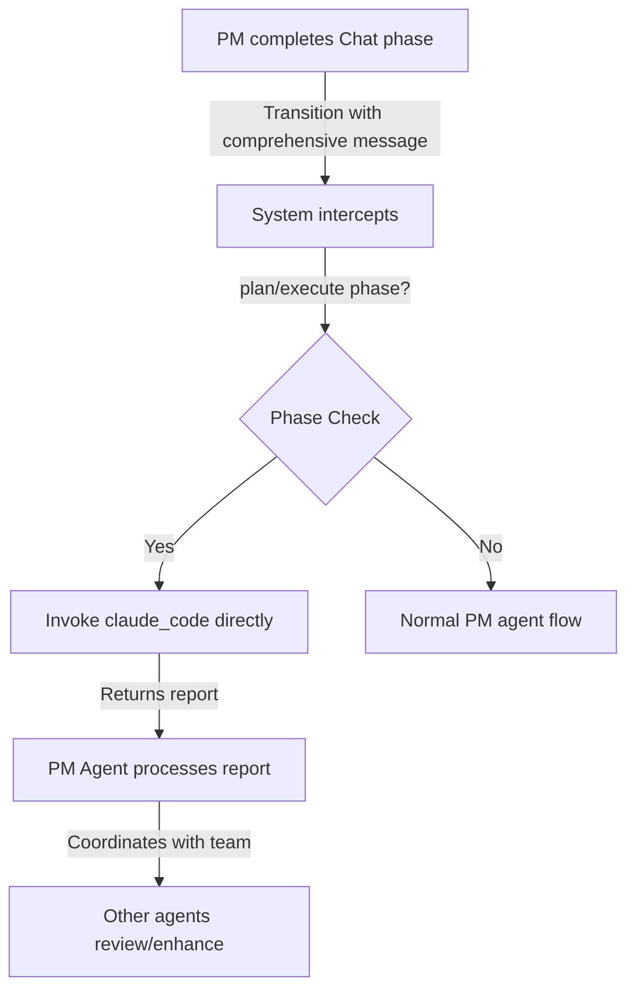

# TENEX Phase Transition Enhancement Plan

## Executive Summary

This document outlines a comprehensive plan to enhance TENEX's phase transition system by making the `message` field mandatory for rich context transfer and integrating Claude Code for direct execution during plan/execute phases.

### Key Insights from Analysis
- The `PhaseTransition` interface already exists but isn't integrated into the `Conversation` interface
- The current optional `message` field in `next_action` is underutilized, causing context loss
- Direct Claude Code integration is identified as a "game changer" for efficiency
- The system already has phase-aware infrastructure that we can enhance rather than rebuild

## Problem Statement

### Current Issues
1. **Inefficient Context Transfer**: Phase transitions only pass a simple "reason" string
2. **Token Waste**: Each phase must parse entire conversation history to understand context
3. **Redundant Processing**: Agents repeatedly analyze the same information
4. **Limited Autonomy**: Plan/execute phases don't leverage specialized AI tools effectively

### Example of Current Flow
```
PM Agent: next_action(action: "phase_transition", target: "plan", reason: "requirements are clear")
// Next phase receives only: "requirements are clear"
// Must parse entire conversation to understand WHAT the requirements actually are
```

## Proposed Solution

### 1. Mandatory Message Field for Rich Context

Transform phase transitions by making the `message` field mandatory and using it to carry comprehensive phase learnings.

#### Data Structure Enhancement
```typescript
// Current
interface NextActionArgs {
  action: "handoff" | "phase_transition";
  target: string;
  reason?: string;
  message?: string;
}

// Enhanced
interface NextActionArgs {
  action: "handoff" | "phase_transition";
  target: string;
  reason?: string;  // Optional brief description
  message: string;  // NOW MANDATORY: Carries comprehensive context
}
```

#### Message Content Guidelines

The mandatory `message` field should contain comprehensive phase learnings:

**Chat → Plan Transition**
```
Message includes:
- User's primary objectives
- Functional requirements (explicit and inferred)
- Technical constraints mentioned
- Success criteria
- Any preferences or priorities expressed
- Questions that were clarified
```

**Plan → Execute Transition**
```
Message includes:
- The approved implementation plan
- Step-by-step breakdown
- Technical decisions made
- Dependencies identified
- Risk mitigation strategies
- Acceptance criteria for each component
```

**Execute → Review Transition**
```
Message includes:
- Components implemented
- Files created/modified
- Tests written
- Known issues or limitations
- Areas needing review
- Performance considerations
```

### 2. Direct Claude Code Integration

For plan/execute phases, the system will automatically invoke Claude Code with the transition message, bypassing initial PM agent processing.

#### New Integration Flow


#### Implementation Strategy
1. System intercepts phase transitions to plan/execute
2. Automatically invokes `claude_code` with the transition message
3. PM agent receives claude_code output to process
4. PM coordinates follow-up actions based on the report

## Technical Implementation

### Phase 1: Core Infrastructure Changes

#### 1.1 Update NextAction Tool
**File**: `src/tools/implementations/nextAction.ts`

```typescript
// Update interface to make message mandatory
interface NextActionArgs {
  action: "handoff" | "phase_transition";
  target: string;
  reason?: string;
  message: string;  // NOW MANDATORY
}

// Update tool instructions
instructions: `...
IMPORTANT: The 'message' field is MANDATORY for all next_action calls.
For phase transitions, use 'message' to provide comprehensive context:
<tool_use>{ 
  "tool": "next_action", 
  "args": { 
    "action": "phase_transition", 
    "target": "plan", 
    "reason": "requirements clear",
    "message": "## User Requirements\\n- Build a CLI tool...\\n## Constraints\\n- Must be Python 3.8+..."
  }
}</tool_use>
...`

// Validate mandatory message field
async function handlePhaseTransition(args: NextActionArgs, context: NextActionContext): Promise<ToolResult> {
  // Validate mandatory message
  if (!args.message) {
    return {
      success: false,
      error: 'Message is required for phase transitions'
    };
  }
  
  // ... existing validation ...
  
  return {
    success: true,
    output: `Phase transition to '${args.target}' requested${args.reason ? `: ${args.reason}` : ""}`,
    metadata: {
      actionType: 'phase_transition',
      requestedPhase: args.target,
      currentPhase: currentPhase,
      fromAgentPubkey: context.agent.pubkey,
      fromAgentName: context.agent.name,
      transitionMessage: args.message // Pass comprehensive context
    }
  };
}
```

#### 1.2 Update AgentExecutor with Direct Claude Code Integration
**File**: `src/agents/execution/AgentExecutor.ts`

```typescript
// In processNextActionResults method
if (actionType === "phase_transition") {
  const requestedPhase = metadata.requestedPhase as string;
  const transitionMessage = metadata.transitionMessage as string;
  phaseTransition = requestedPhase;
  
  if (this.conversationManager) {
    try {
      await this.conversationManager.updatePhase(
        context.conversation.id,
        requestedPhase as Phase,
        transitionMessage
      );
      
      // Direct Claude Code invocation for plan/execute phases
      if (requestedPhase === 'plan' || requestedPhase === 'execute') {
        // Add safeguards to prevent infinite loops or unexpected behavior
        const shouldAutoInvoke = this.shouldAutoInvokeClaudeCode(context, requestedPhase);
        
        if (shouldAutoInvoke) {
          const claudeResult = await this.invokeClaudeCodeDirectly(
            transitionMessage,
            requestedPhase,
            context
          );
          
          // Store result for PM agent to process
          context.additionalContext = {
            claudeCodeReport: claudeResult.output,
            claudeCodeSuccess: claudeResult.success,
            directExecution: true
          };
        }
      }
      
      logger.info("Phase transition processed", {
        conversationId: context.conversation.id,
        fromPhase: context.phase,
        toPhase: requestedPhase,
        directClaudeCode: requestedPhase === 'plan' || requestedPhase === 'execute'
      });
    } catch (error) {
      logger.error("Failed to update conversation phase", { error });
    }
  }
}

// New method for direct Claude Code invocation
private async invokeClaudeCodeDirectly(
  message: string,
  phase: string,
  context: AgentExecutionContext
): Promise<ToolResult> {
  const claudeCodeTool = this.toolExecutor.getTool('claude_code');
  if (!claudeCodeTool) {
    return { success: false, error: 'Claude Code tool not available' };
  }
  
  return await claudeCodeTool.run(
    {
      prompt: message,
      mode: phase === 'plan' ? 'plan' : 'run'
    },
    {
      projectPath: context.projectPath,
      phase: context.phase,
      agent: context.agent,
      agentName: context.agent.name
    }
  );
}

// Safeguard method to determine if automatic invocation should occur
private shouldAutoInvokeClaudeCode(
  context: AgentExecutionContext, 
  phase: string
): boolean {
  // Prevent auto-invocation if already in a claude_code execution context
  if (context.additionalContext?.directExecution) {
    return false;
  }
  
  // Add other conditions as needed
  return true;
}
```

#### 1.3 Update Conversation Types for First-Class Phase Transitions
**File**: `src/conversations/types.ts`

```typescript
// NOTE: PhaseTransition interface already exists but needs enhancement
// Replace the existing interface entirely with:
export interface PhaseTransition {
  from: Phase;
  to: Phase;
  message: string;        // Comprehensive context from the transition
  timestamp: number;
  agentPubkey: string;    // NEW: Track which agent initiated
  agentName: string;      // NEW: Human-readable agent name
  reason?: string;        // Brief description (optional)
}

export interface Conversation {
  id: string;
  title: string;
  phase: Phase;
  history: NDKEvent[];
  phaseStartedAt?: number;
  metadata: ConversationMetadata;
  phaseTransitions: PhaseTransition[];  // NEW: Integrate transitions as first-class
}
```

#### 1.4 Update ConversationManager
**File**: `src/conversations/ConversationManager.ts`

```typescript
async updatePhase(id: string, phase: Phase, message: string): Promise<void> {
  const conversation = this.conversations.get(id);
  if (!conversation) {
    throw new Error(`Conversation ${id} not found`);
  }

  const previousPhase = conversation.phase;
  
  // Check if phase is actually changing
  if (previousPhase === phase) {
    return;
  }

  // Create phase transition record
  const transition: PhaseTransition = {
    from: previousPhase,
    to: phase,
    message,
    timestamp: Date.now(),
    agentPubkey: context.agent.pubkey,
    agentName: context.agent.name
  };

  // Update conversation
  conversation.phase = phase;
  conversation.phaseStartedAt = Date.now();
  conversation.phaseTransitions.push(transition);

  // Log transition
  tracingLogger.logTransition(previousPhase, phase, {
    message: message.substring(0, 100) + '...',  // Log preview
    conversationTitle: conversation.title,
  });
}
```

#### 1.5 Update Phase Context Retrieval
**File**: `src/prompts/fragments/agentFragments.ts`

```typescript
function getPhaseContext(phase: Phase, conversation: Conversation): string | null {
  // Get the most recent transition into this phase
  const transitions = conversation.phaseTransitions || [];
  const latestTransition = transitions
    .filter(t => t.to === phase)
    .sort((a, b) => b.timestamp - a.timestamp)[0];
  
  if (latestTransition) {
    return `### Context from Previous Phase\n${latestTransition.message}`;
  }
  
  return null;
}
```

### Phase 2: PM Agent Enhancement

#### 2.1 Phase-Specific Instruction Injection
**File**: `src/prompts/fragments/phase.ts`

```typescript
// Dynamic instruction generation based on phase transition
export function getPhaseTransitionInstructions(fromPhase: Phase, toPhase: Phase): string {
  if (fromPhase === 'chat' && toPhase === 'plan') {
    return `
## Transitioning to PLAN Phase

You are moving from requirements gathering to planning. In your transition message, include:

1. **Project Overview**: Clear description of what the user wants to build
2. **Functional Requirements**: All features requested (explicit and inferred)
3. **Technical Constraints**: Language, framework, performance requirements
4. **Success Criteria**: How we'll know the project meets expectations
5. **Priorities**: If multiple features, their relative importance

Format this as a comprehensive brief that Claude Code can use to create a detailed plan.`;
  }
  
  if (fromPhase === 'plan' && toPhase === 'execute') {
    return `
## Transitioning to EXECUTE Phase

You are moving from planning to implementation. In your transition message, include:

1. **Approved Plan**: The complete implementation strategy
2. **Technical Decisions**: Architecture, patterns, libraries to use
3. **Implementation Steps**: Clear sequence of tasks
4. **Dependencies**: What needs to be done first
5. **Acceptance Criteria**: How to verify each component

This message will be sent directly to Claude Code for implementation.`;
  }
  
  if (fromPhase === 'execute' && toPhase === 'review') {
    return `
## Transitioning to REVIEW Phase

You are moving from implementation to review. In your transition message, include:

1. **Work Completed**: All files created/modified
2. **Features Implemented**: What functionality was added
3. **Tests Written**: Testing coverage
4. **Known Issues**: Any problems or limitations
5. **Review Focus**: Areas needing special attention`;
  }
  
  // Default for other transitions
  return `
## Phase Transition

Provide a comprehensive summary of the work completed in the ${fromPhase} phase
and clear context for the ${toPhase} phase.`;
}
```

#### 2.2 PM Agent Prompt Processing
**File**: `src/prompts/fragments/project.ts`

```typescript
// When PM agent is invoked after a phase transition
const pmAgentPrompt = ({ phase, previousPhase, claudeCodeReport }) => {
  const parts = [];
  
  // If we have a Claude Code report from direct invocation
  if (claudeCodeReport && (phase === 'plan' || phase === 'execute')) {
    parts.push(`
## Claude Code Report

Claude Code has completed the following work:

${claudeCodeReport}

Your role now is to:
1. Review the work completed
2. Identify any gaps or issues
3. Coordinate with other agents as needed
4. Determine next steps
`);
  }
  
  // Phase-specific instructions only for current phase
  parts.push(getPhaseInstructions(phase));
  
  return parts.join('\n\n');
};
```

#### 2.2 Update Phase-Specific Tool Availability
**File**: `src/agents/constants.ts` (or equivalent)

```typescript
export function getDefaultToolsForAgent(isPMAgent: boolean, phase: Phase): string[] {
  const baseTools = ['read_file', 'search_files', 'list_directory'];
  
  if (isPMAgent) {
    const pmTools = [...baseTools, 'next_action', 'get_agents'];
    
    // Add claude_code tool for plan and execute phases
    if (phase === 'plan' || phase === 'execute') {
      pmTools.push('claude_code');
    }
    
    // Add requirements tool only for chat phase
    if (phase === 'chat') {
      pmTools.push('get_current_requirements');
    }
    
    return pmTools;
  }
  
  // ... rest of function
}
```

### Phase 3: Testing and Validation

#### 3.1 Test Cases

1. **Message Flow Test**
   - Verify mandatory message validation
   - Confirm message is passed through entire pipeline
   - Validate storage in phaseTransitions array
   - Verify retrieval in next phase

2. **Direct Claude Code Integration Test**
   - Test automatic claude_code invocation for plan/execute
   - Verify PM agent receives claude_code report
   - Confirm PM agent can coordinate based on report

3. **Phase-Specific Instructions Test**
   - Verify correct instructions are injected per phase
   - Confirm PM agent follows transition guidelines
   - Test message quality for each transition type

#### 3.2 Validation Metrics
- Token usage reduction (measure before/after)
- Phase transition clarity (qualitative assessment)
- Implementation speed (time from plan to execute)
- Error rates in phase transitions
- Quality of claude_code execution from messages

## Benefits Analysis

### Token Efficiency
- **Before**: ~5000-10000 tokens to reparse conversation history
- **After**: ~500-1000 tokens for focused summary
- **Savings**: 80-90% reduction in context tokens per phase

### Clarity Improvements
- Agents receive structured, relevant information
- No ambiguity about previous phase outcomes
- Clear action items and constraints

### Execution Speed
- Claude Code can work autonomously with clear directives
- Less back-and-forth clarification needed
- Parallel execution possibilities

## Risk Mitigation

### Potential Risks
1. **Summary Quality**: PM agent might create poor summaries
   - **Mitigation**: Clear prompt engineering with examples
   
2. **Information Loss**: Important details might be omitted
   - **Mitigation**: Agents can still access full history if needed
   
3. **Claude Code Errors**: Autonomous execution might go wrong
   - **Mitigation**: PM agent reviews and can course-correct

## Implementation Timeline

### Phase 1: Core Infrastructure (2-3 days)
- [ ] Make `message` field mandatory in NextActionArgs interface
- [ ] Replace existing PhaseTransition interface with enhanced version
- [ ] Add `phaseTransitions[]` array to Conversation interface
- [ ] Update ConversationManager to store transitions
- [ ] Implement safeguarded automatic Claude Code invocation

### Phase 2: PM Agent Enhancement (2-3 days)
- [ ] Implement phase-specific instruction injection
- [ ] Update PM agent to process Claude Code reports
- [ ] Remove phase-specific tool restrictions for plan/execute
- [ ] Test message quality for each transition type

### Phase 3: Testing & Polish (1-2 days)
- [ ] Test mandatory message validation
- [ ] Verify automatic Claude Code invocation with safeguards
- [ ] Measure token usage reduction
- [ ] Update any affected documentation

## Success Criteria

1. **Functional Success**
   - Phase transitions include rich summaries
   - Claude Code successfully executes from summaries
   - Context is properly preserved and retrieved

2. **Performance Success**
   - 50%+ reduction in token usage
   - Faster phase transitions
   - Improved implementation accuracy

3. **User Experience Success**
   - Clearer progress visibility
   - Better quality implementations
   - Reduced need for clarifications

## Key Architectural Decisions

### 1. Mandatory Message Field
- Unifies interface for both handoffs and phase transitions
- Ensures proper context transfer is always provided
- Simplifies codebase by having one field for communication

### 2. First-Class Phase Transitions
- Adds `phaseTransitions[]` array to Conversation type
- Preserves full transition history with proper structure
- Makes phase context retrieval straightforward and reliable

### 3. Direct Claude Code Integration
- System automatically invokes claude_code for plan/execute phases
- PM agent receives report and coordinates follow-up
- Leverages specialized tools immediately without delay

### 4. Phase-Specific Instruction Injection
- Only relevant instructions are provided per phase
- Reduces token usage and improves agent focus
- Dynamic generation based on actual transition occurring

## Implementation Notes from Codebase Analysis

Based on the existing codebase review:

1. **Leverage Existing Infrastructure**: The system already has `processNextActionResults` in AgentExecutor and phase-aware tool injection
2. **Minimal Breaking Changes**: Most `next_action` calls already include messages, so making it mandatory has low impact
3. **Tool Architecture Ready**: The modular tool system makes adding automatic claude_code invocation straightforward
4. **Phase Management Exists**: ConversationManager already handles phase updates, we're just enhancing it

## Conclusion

This enhancement transforms TENEX's phase transitions from simple state changes to intelligent knowledge transfer points with direct tool integration. By making messages mandatory and invoking Claude Code directly for plan/execute phases, we create a more efficient, clear, and powerful system that better leverages specialized AI capabilities.

The implementation follows KISS, DRY, and YAGNI principles:
- **KISS**: One mandatory field, automatic tool invocation with safeguards
- **DRY**: Enhances existing infrastructure rather than creating new systems
- **YAGNI**: Focused changes that address specific pain points

The feedback confirms this approach addresses "critical gaps" and provides "game changing" improvements while maintaining architectural integrity.