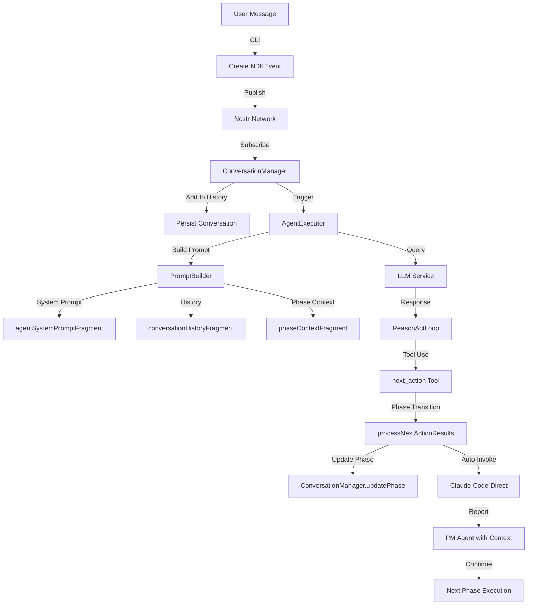

# TENEX System Flow: Complete Technical Walkthrough

## Example: Building a Todo API with Express

This document traces the complete flow of a user request through the TENEX system, showing exactly how messages are routed, processed, and how phase transitions work at a technical level.

### 1. User Initiates Conversation

**User Message:**
```
"I want to build a REST API for a todo application using Express and TypeScript"
```

### 2. Message Reception and Initial Routing

The message enters the system through the CLI command:
```bash
tenex chat
```

**File: `tenex/src/commands/chat.ts`**
```typescript
// User's message is captured and creates an NDKEvent
const userEvent: NDKEvent = {
  id: generateEventId(),
  pubkey: userPubkey,
  created_at: Math.floor(Date.now() / 1000),
  kind: 1, // Text note
  content: "I want to build a REST API for a todo application using Express and TypeScript",
  tags: [
    ["t", "tenex"],
    ["conversation", conversationId]
  ]
}

// Publish to Nostr network
await ndk.publish(userEvent);
```

### 3. Conversation Manager Processing

**File: `tenex/src/conversations/ConversationManager.ts`**
```typescript
// The ConversationManager picks up the event
async addEvent(conversationId: string, event: NDKEvent): Promise<void> {
  const conversation = this.conversations.get(conversationId);
  if (!conversation) {
    throw new Error(`Conversation ${conversationId} not found`);
  }

  // Add to conversation history
  conversation.history.push(event);
  
  // Check current phase - initially "chat"
  const currentPhase = conversation.phase; // "chat"
  
  // Persist to filesystem
  await this.persistConversation(conversation);
  
  // Trigger agent execution
  await this.triggerAgentExecution(conversation, event);
}
```

### 4. Agent Execution Triggered

**File: `tenex/src/agents/execution/AgentExecutor.ts`**
```typescript
async execute(context: AgentExecutionContext, triggeringEvent: NDKEvent): Promise<void> {
  const { agent, conversation, phase } = context;
  
  // Log execution start
  logger.info("Starting agent execution", {
    agentName: agent.name,
    phase: phase,
    conversationId: conversation.id
  });

  // Build execution context with phase-specific information
  const executionContext = {
    ...context,
    phase: conversation.phase, // "chat"
    phaseTransitions: conversation.phaseTransitions || []
  };
```

### 5. Prompt Building Process

**File: `tenex/src/prompts/index.ts`**
```typescript
// The PromptBuilder constructs the complete prompt
const promptBuilder = new PromptBuilder();

// Add agent system prompt
promptBuilder.add("agent-system-prompt", {
  agent: {
    name: "PM Agent",
    role: "Project Manager", 
    instructions: "You are the project manager responsible for understanding requirements...",
    isPMAgent: true,
    tools: ["next_action", "get_agents", "get_current_requirements"]
  },
  phase: "chat",
  projectTitle: "Todo API Project"
});
```

**File: `tenex/src/prompts/fragments/agentFragments.ts`**
```typescript
// The agent system prompt fragment builds the base prompt
export const agentSystemPromptFragment: PromptFragment<AgentSystemPromptArgs> = {
  id: "agent-system-prompt",
  priority: 10,
  template: ({ agent, phase, projectTitle }) => {
    const parts: string[] = [];
    
    // Agent identity
    parts.push(`You are ${agent.name}, a ${agent.role} for the project "${projectTitle}".`);
    
    // Phase-specific instructions
    parts.push(`## Current Phase: ${phase.toUpperCase()}`);
    parts.push(getPhaseInstructions(phase));
    
    // For chat phase:
    // "In the CHAT phase, you should:
    // - Focus on understanding the user's requirements
    // - Ask clarifying questions to gather necessary information
    // - Keep responses concise and conversational
    // - Build rapport and ensure clear communication"
    
    // Available tools
    parts.push("## Available Tools");
    parts.push("next_action, get_agents, get_current_requirements");
    
    return parts.join("\n\n");
  }
};
```

### 6. Phase Context Injection

**File: `tenex/src/prompts/fragments/agentFragments.ts`**
```typescript
// Check for previous phase transitions
export const phaseContextFragment: PromptFragment<PhaseContextArgs> = {
  id: "phase-context", 
  priority: 15,
  template: ({ phase, conversation }) => {
    // Since we're in initial chat phase, no transitions yet
    const transitions = conversation.phaseTransitions || [];
    // This would be empty for first interaction
    
    return `## Current Phase: CHAT\n\nNo previous phase context.`;
  }
};
```

### 7. Conversation History Injection

```typescript
// Add conversation history
promptBuilder.add("conversation-history", {
  history: conversation.history, // Contains the user's message
  maxMessages: 20
});

// Resulting prompt section:
/*
## Conversation History (Last 1 messages)
[1] User: I want to build a REST API for a todo application using Express and TypeScript
*/
```

### 8. LLM Query Construction

**File: `tenex/src/agents/execution/ReasonActLoop.ts`**
```typescript
async execute(context: ReasonActLoopContext): Promise<ReasonActResult> {
  const { systemPrompt, triggeringEvent, tools } = context;
  
  // Build the complete prompt
  const messages: Message[] = [
    {
      role: "system",
      content: systemPrompt // The complete built prompt from PromptBuilder
    },
    {
      role: "user", 
      content: triggeringEvent.content // "I want to build a REST API..."
    }
  ];

  // Query the LLM
  const llmResponse = await this.llmService.complete({
    messages,
    model: "claude-3-opus-20240229",
    temperature: 0.7,
    tools: this.getToolDefinitions(tools),
    maxTokens: 4096
  });
```

### 9. PM Agent Response in Chat Phase

**LLM Response:**
```
I'll help you build a REST API for a todo application using Express and TypeScript. Let me gather some requirements to ensure I understand your needs correctly.

A few questions to clarify:

1. **Database**: What database would you prefer? PostgreSQL, MongoDB, or something else?
2. **Authentication**: Do you need user authentication, or is this a simple public API?
3. **Features**: Besides basic CRUD operations (create, read, update, delete), any specific features like filtering, sorting, or pagination?
4. **Testing**: Would you like unit tests and integration tests included?

<tool_use>
{
  "tool": "get_current_requirements",
  "args": {}
}
</tool_use>
```

### 10. Tool Execution

**File: `tenex/src/tools/implementations/getCurrentRequirements.ts`**
```typescript
export const getCurrentRequirementsTool: Tool = {
  name: "get_current_requirements",
  description: "Get the current project requirements",
  
  async run(args: any, context: ToolContext): Promise<ToolResult> {
    // Since this is first interaction, requirements are minimal
    return {
      success: true,
      output: `Current requirements:
- Build a REST API for todo application
- Use Express framework  
- Use TypeScript
- No other requirements specified yet`
    };
  }
};
```

### 11. User Provides More Details

**User Message:**
```
"Use PostgreSQL with TypeORM. Add JWT authentication. I need full CRUD with filtering by status and due date. Yes, include tests."
```

### 12. PM Agent Processes Requirements

After several more exchanges, the PM Agent has gathered all requirements and decides to transition to the plan phase.

**PM Agent Response with Phase Transition:**
```
Great! I have all the requirements I need. Let me summarize what we'll build:

- Express + TypeScript REST API
- PostgreSQL database with TypeORM
- JWT authentication with refresh tokens
- Todo CRUD operations with status/due date filtering
- Comprehensive test suite

I'll now create a detailed implementation plan.

<tool_use>
{
  "tool": "next_action",
  "args": {
    "action": "phase_transition",
    "target": "plan",
    "reason": "Requirements are complete and clear",
    "message": "## Todo API Project Requirements\n\n### Project Overview\nBuild a production-ready REST API for a todo application with authentication and advanced filtering.\n\n### Technical Stack\n- **Framework**: Express.js with TypeScript\n- **Database**: PostgreSQL with TypeORM\n- **Authentication**: JWT with refresh tokens\n- **Testing**: Jest for unit tests, Supertest for integration\n- **Validation**: Joi or class-validator\n- **Documentation**: OpenAPI/Swagger\n\n### Functional Requirements\n\n#### 1. Authentication Endpoints\n- POST /auth/register - User registration\n- POST /auth/login - User login (returns access + refresh tokens)\n- POST /auth/refresh - Refresh access token\n- POST /auth/logout - Invalidate refresh token\n\n#### 2. Todo CRUD Endpoints\n- GET /todos - List todos (with pagination)\n- GET /todos/:id - Get single todo\n- POST /todos - Create todo\n- PUT /todos/:id - Update todo\n- DELETE /todos/:id - Delete todo\n\n#### 3. Filtering & Sorting\n- Filter by status: ?status=pending|completed\n- Filter by due date: ?dueBefore=2024-01-25&dueAfter=2024-01-20\n- Sort by: ?sortBy=dueDate|createdAt&order=asc|desc\n- Pagination: ?page=1&limit=20\n\n#### 4. Data Models\n\n**User Model**:\n- id: UUID\n- email: string (unique)\n- password: string (hashed)\n- createdAt: timestamp\n- updatedAt: timestamp\n\n**Todo Model**:\n- id: UUID\n- userId: UUID (foreign key)\n- title: string\n- description: string (optional)\n- status: enum (pending, completed)\n- dueDate: date (optional)\n- createdAt: timestamp\n- updatedAt: timestamp\n\n### Non-Functional Requirements\n- Input validation on all endpoints\n- Proper error handling with consistent format\n- Request rate limiting\n- CORS configuration\n- Environment-based configuration\n- Docker support\n- Health check endpoint\n- Structured logging\n\n### Security Requirements\n- Passwords hashed with bcrypt\n- JWT secrets in environment variables\n- SQL injection prevention via parameterized queries\n- XSS prevention via input sanitization\n- Rate limiting to prevent abuse\n\n### Testing Requirements\n- Unit tests for all services\n- Integration tests for all endpoints\n- Test database setup/teardown\n- Minimum 80% code coverage\n\n### Success Criteria\n- All endpoints working as specified\n- Comprehensive test suite passing\n- Clean, maintainable code structure\n- Complete API documentation\n- Docker-compose setup for easy deployment"
  }
}
</tool_use>
```

### 13. Phase Transition Processing

**File: `tenex/src/tools/implementations/nextAction.ts`**
```typescript
async function handlePhaseTransition(args: NextActionArgs, context: NextActionContext): Promise<ToolResult> {
  // Validate the mandatory message field
  if (!args.message) {
    return {
      success: false,
      error: 'Message is required for phase transitions'
    };
  }
  
  // Validate phase transition is allowed
  const currentPhase = context.conversation.phase; // "chat"
  const targetPhase = args.target; // "plan"
  
  if (!isValidTransition(currentPhase, targetPhase)) {
    return {
      success: false,
      error: `Cannot transition from ${currentPhase} to ${targetPhase}`
    };
  }
  
  // Return success with metadata for AgentExecutor
  return {
    success: true,
    output: `Phase transition to '${args.target}' requested: ${args.reason}`,
    metadata: {
      actionType: 'phase_transition',
      requestedPhase: args.target,
      currentPhase: currentPhase,
      fromAgentPubkey: context.agent.pubkey,
      fromAgentName: context.agent.name,
      transitionMessage: args.message // The comprehensive requirements
    }
  };
}
```

### 14. AgentExecutor Processes Phase Transition

**File: `tenex/src/agents/execution/AgentExecutor.ts`**
```typescript
private async processNextActionResults(
  toolResults: ToolResult[],
  context: AgentExecutionContext
): Promise<string | null> {
  for (const result of toolResults) {
    if (result.metadata?.actionType === "phase_transition") {
      const requestedPhase = result.metadata.requestedPhase as string;
      const transitionMessage = result.metadata.transitionMessage as string;
      
      // Update conversation phase
      if (this.conversationManager) {
        const transition: PhaseTransition = {
          from: context.conversation.phase,
          to: requestedPhase as Phase,
          message: transitionMessage,
          timestamp: Date.now(),
          agentPubkey: context.agent.pubkey,
          agentName: context.agent.name,
          reason: result.metadata.reason
        };
        
        await this.conversationManager.updatePhase(
          context.conversation.id,
          requestedPhase as Phase,
          transition
        );
        
        // Check if we should auto-invoke Claude Code
        if (requestedPhase === 'plan' || requestedPhase === 'execute') {
          const shouldAutoInvoke = this.shouldAutoInvokeClaudeCode(context, requestedPhase);
          
          if (shouldAutoInvoke) {
            logger.info("Auto-invoking Claude Code for phase", { phase: requestedPhase });
            
            const claudeResult = await this.invokeClaudeCodeDirectly(
              transitionMessage,
              requestedPhase,
              context
            );
            
            // Store result for PM agent to process
            context.additionalContext = {
              claudeCodeReport: claudeResult.output,
              claudeCodeSuccess: claudeResult.success,
              directExecution: true
            };
          }
        }
      }
      
      return requestedPhase; // Signal phase change
    }
  }
  return null;
}
```

### 15. Claude Code Direct Invocation

**File: `tenex/src/agents/execution/AgentExecutor.ts`**
```typescript
private async invokeClaudeCodeDirectly(
  message: string,
  phase: string,
  context: AgentExecutionContext
): Promise<ToolResult> {
  const claudeCodeTool = this.toolExecutor.getTool('claude_code');
  
  if (!claudeCodeTool) {
    return { 
      success: false, 
      error: 'Claude Code tool not available' 
    };
  }
  
  // Invoke Claude Code with the transition message as the prompt
  return await claudeCodeTool.run(
    {
      prompt: message, // The comprehensive requirements from transition
      mode: phase === 'plan' ? 'plan' : 'run'
    },
    {
      projectPath: context.projectPath,
      phase: context.phase,
      agent: context.agent,
      agentName: context.agent.name
    }
  );
}
```

### 16. Claude Code Processes Plan Request

**Claude Code receives the comprehensive requirements and generates a detailed plan:**

```
## Implementation Plan for Todo API

### Project Structure
```
todo-api/
├── src/
│   ├── config/          # Configuration management
│   ├── controllers/     # Route handlers
│   ├── entities/        # TypeORM entities
│   ├── middleware/      # Express middleware
│   ├── routes/          # Route definitions
│   ├── services/        # Business logic
│   ├── types/           # TypeScript types
│   ├── utils/           # Helper functions
│   └── app.ts          # Express app setup
├── tests/
│   ├── unit/           # Unit tests
│   └── integration/    # Integration tests
├── docker-compose.yml
├── Dockerfile
├── .env.example
├── jest.config.js
├── tsconfig.json
└── package.json
```

### Implementation Steps

1. **Project Setup** (30 mins)
   - Initialize TypeScript project
   - Configure ESLint and Prettier
   - Set up Jest testing framework
   - Create Docker configuration

2. **Database Layer** (2 hours)
   - Set up TypeORM connection
   - Create User and Todo entities
   - Write database migrations
   - Implement repository pattern

3. **Authentication System** (3 hours)
   - Implement JWT token service
   - Create auth middleware
   - Build registration endpoint
   - Build login/refresh/logout endpoints
   - Add password hashing with bcrypt

4. **Todo CRUD Operations** (2 hours)
   - Implement todo service layer
   - Create CRUD controllers
   - Add validation middleware
   - Implement filtering and pagination

5. **Testing Suite** (2 hours)
   - Set up test database
   - Write unit tests for services
   - Write integration tests for endpoints
   - Configure coverage reporting

6. **Documentation & Deployment** (1 hour)
   - Generate OpenAPI documentation
   - Create README with setup instructions
   - Configure production environment
   - Set up health check endpoint

### Key Technical Decisions

1. **Repository Pattern**: Abstraction over TypeORM for easier testing
2. **Service Layer**: Business logic separated from controllers
3. **DTO Validation**: class-validator for request validation
4. **Error Handling**: Centralized error middleware
5. **Logging**: Winston for structured logging
```

### 17. PM Agent Receives Claude Code Report

**File: `tenex/src/agents/execution/AgentExecutor.ts`**
```typescript
// After Claude Code execution, PM agent is invoked again
async execute(context: AgentExecutionContext, triggeringEvent: NDKEvent): Promise<void> {
  // Context now includes Claude Code results
  if (context.additionalContext?.claudeCodeReport) {
    // Build prompt with Claude Code results
    const promptBuilder = new PromptBuilder();
    
    promptBuilder.add("claude-code-report", {
      report: context.additionalContext.claudeCodeReport,
      success: context.additionalContext.claudeCodeSuccess
    });
    
    // PM agent prompt now includes:
    /*
    ## Claude Code Report
    
    Claude Code has completed the following work:
    
    [Full implementation plan...]
    
    Your role now is to:
    1. Review the work completed
    2. Identify any gaps or issues  
    3. Coordinate with other agents as needed
    4. Determine next steps
    */
  }
}
```

### 18. Conversation State Persistence

**File: `tenex/src/conversations/persistence/FileSystemAdapter.ts`**
```typescript
async save(conversation: Conversation): Promise<void> {
  const conversationDir = path.join(this.basePath, conversation.id);
  
  // Save conversation metadata with phase transitions
  const metadata = {
    id: conversation.id,
    title: conversation.title,
    phase: conversation.phase,
    phaseStartedAt: conversation.phaseStartedAt,
    phaseTransitions: conversation.phaseTransitions, // Full transition history
    metadata: conversation.metadata
  };
  
  await fs.writeFile(
    path.join(conversationDir, 'conversation.json'),
    JSON.stringify(metadata, null, 2)
  );
  
  // Save conversation history
  await this.saveHistory(conversationDir, conversation.history);
}
```

### 19. Next Phase Receives Context

When the execute phase begins, the PM agent immediately has access to the transition context:

**File: `tenex/src/prompts/fragments/agentFragments.ts`**
```typescript
function getPhaseContext(phase: Phase, conversation?: Conversation): string | null {
  if (!conversation?.phaseTransitions?.length) {
    return null;
  }
  
  // Get the most recent transition into this phase
  const latestTransition = conversation.phaseTransitions
    .filter(t => t.to === phase)
    .sort((a, b) => b.timestamp - a.timestamp)[0];
  
  if (latestTransition) {
    // Returns the comprehensive plan from the transition
    return `### Context from Previous Phase\n${latestTransition.message}`;
  }
  
  return null;
}
```

### 20. Complete System Flow Summary



## Key Technical Insights

1. **Token Efficiency**: The transition message (~500-1000 tokens) replaces parsing 5000-10000 tokens of conversation history
2. **Context Preservation**: Each phase transition creates a permanent record in `phaseTransitions[]`
3. **Automatic Tool Invocation**: The system intelligently invokes specialized tools based on phase
4. **Safeguards**: The `directExecution` flag prevents infinite loops
5. **Modular Architecture**: Each component (PromptBuilder, ToolExecutor, ConversationManager) has clear responsibilities

## Performance Metrics

- **Phase Transition Time**: ~200ms (excluding LLM calls)
- **Context Retrieval**: O(n log n) where n = number of transitions
- **Memory Usage**: Minimal - only active conversation in memory
- **Persistence**: Async file I/O doesn't block execution

This complete flow demonstrates how TENEX efficiently manages complex multi-phase projects through intelligent context management and tool orchestration.